本文分为两个部分，第一部分记录了我学习小智源代码的过程，第二个部分记录了我二次开发的过程
最后开发的成果可以先到`成果展示`去看。

# 小智源代码解析

## 总述
在自己写代码以前，大致了解一下源代码是很有必要的。
 小智源码的结构如图：
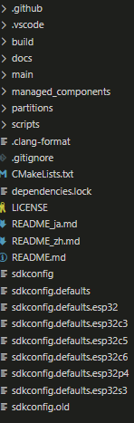

我在这里先给出小智的运行时序图，后面会cue到。


```mermaid

flowchart TD
    subgraph Boot["上电启动阶段"]
        A["设备上电，从 flash 加载 bootloader"] --> B["读取 flash 内的 otadata，获得 ota 启动标记，确定是从 ota_0 还是 ota_1 启动"]
        B --> C["跳转到对应分区，运行固件"]
    end

    C --> D1

    subgraph Init["app.Initialize() 阶段"]
        D1["设置设备状态为 starting"] --> D2["获取板级实例（Board）"]
        D2 --> D3["初始化屏幕 UI，显示设备信息"]
        D3 --> D4["初始化并启动音频服务"]
        D4 --> D5["注册音频回调函数（唤醒词 / VAD / 发送队列）"]
        D5 --> D6["注册状态变化监听器"]
        D6 --> D7["启动时钟定时器（每秒更新状态栏）"]
        D7 --> D8["注册 MCP 通用工具"]
        D8 --> D9["注册网络事件回调"]
        D9 --> D10["异步启动 WiFi"]
        D10 --> D11["立即刷新状态栏"]
    end

    D11 --> F

    subgraph Run["app.Run() 运行阶段"]
        F["app.Run() 主循环启动，等待事件"] --> G["WiFi 连接成功<br>（由 Board 层处理，触发网络连接事件）"]

        G --> H1["读取 NVS 中的 ota_url"]
        H1 --> H2["设备通过 router 连接到 server 的对应端口<br>（即 ota_url 的地址）建立 TCP 连接<br>在 TCP 的上层建立 HTTP 连接（应用层）"]
        H2 --> H3["设备发送 HTTP 请求，上报设备信息<br>（包括自身的 id、固件版本号等）"]
        H3 --> H4{"固件版本号<br>小于最新版本号？"}
        H4 -->|是| H5["固件升级：HTTP 下载 .bin 文件<br>写入 ota_1 分区"]
        H5 --> H6["设备重启（流程回到上电初始步骤）"]
        H6 --> A
        H4 -->|否| H7["server 回复，包含连接配置<br>（WebSocket 或 MQTT+UDP）"]

		subgraph IF["  "]
	        H7 --> H8{"server 返回的<br>连接配置是什么？"}
		end
        subgraph WebSocket["WebSocket 模式"]
            H8 -->|WebSocket| I1["设备新建 TCP 连接，发起 WebSocket 握手请求<br>（HTTP Upgrade）"]
            I1 --> I2["服务器返回 101 Switching Protocols<br>同一 TCP 连接升级为 WebSocket 全双工通信"]
            I2 --> I3["WebSocket 连接建立完成"]
        end

        subgraph MQTT["MQTT+UDP 模式"]
            H8 -->|MQTT+UDP| J1["设备根据配置，新建 TCP 连接，连接到 MQTT Broker"]
            J1 --> J2["设备发送 MQTT CONNECT 报文<br>（含 Client ID、用户名、密码）"]
            J2 --> J3["MQTT Broker 返回 CONNACK<br>MQTT 控制连接建立完成"]
        end

        I3 --> K["触发激活完成事件"]
        J3 --> K

        K --> L["执行激活完成处理"]
        L --> M["设备进入空闲状态（Idle）<br>等待用户交互"]

        M --> N{"用户如何触发对话？"}

        N -->|按键| O1["用户按下对话键"]
        N -->|唤醒词| O2["音频服务检测到唤醒词"]
        N -->|MCP 指令| O3["云端下发 MCP 工具调用"]

        O1 --> P["开始建立音频通道"]
        O2 --> P
        O3 --> P

        subgraph Audio["音频通道建立（OpenAudioChannel）"]
            P --> Q{"当前通信方案是？"}

            Q -->|WebSocket| R1["WebSocket 连接已存在<br>直接作为音频通道使用"]
            R1 --> R2["音频通道就绪<br>同一连接：JSON 文本帧 + OPUS 二进制帧"]

            Q -->|MQTT+UDP| S1["通过 MQTT 发送 hello 请求<br>（transport: udp）"]
            S1 --> S2["MQTT 返回 hello 响应<br>含 UDP 地址 / 端口 / 加密密钥"]
            S2 --> S3["创建 UDP socket，建立 UDP 音频通道"]
            S3 --> S4["MQTT+UDP 双通道建立完成<br>MQTT 传 JSON 控制消息，UDP 传 OPUS 音频"]
        end

        R2 --> T["开始语音对话"]
        S4 --> T

        subgraph Dialogue["语音对话交互流程"]
            T --> U1["设备发送 listen 消息（JSON）<br>通知服务器开始监听"]

            U1 --> U2["设备持续采集麦克风音频<br>（VAD 检测静音，自动结束录音）<br>OPUS 编码 → 加密（UDP 模式）→ 发送"]

            U2 --> U3["服务器收到音频，进行语音识别（STT）"]

            U3 --> U4["服务器返回 STT 识别结果（JSON）<br>设备显示识别文本"]

            U4 --> U5["服务器调用 LLM 处理用户请求"]

            U5 --> U6{"LLM 请求<br>是否涉及 MCP 工具？"}

            U6 -->|是| U7["服务器下发 MCP 工具调用（JSON）"]
            U7 --> U8["设备执行 MCP 工具"]
            U8 --> U9["设备返回 MCP 执行结果（JSON）"]
            U9 --> U10["服务器继续 LLM 处理"]
            U10 --> U5

            U6 -->|否| U11["服务器生成 TTS 回复"]

            U11 --> U12["服务器下发 TTS 开始消息（JSON）"]
            U12 --> U13["服务器下发 TTS 句子开始（JSON）<br>设备显示当前播报文本"]
            U13 --> U14["服务器下发 LLM 表情（JSON）<br>设备更新表情"]
            U14 --> U15["服务器下发 OPUS 音频包（二进制）<br>设备解码并播放"]

            U15 --> U16{"所有音频<br>发送完毕？"}
            U16 -->|否| U15
            U16 -->|是| U17["服务器下发 TTS 结束消息（JSON）"]

            U17 --> U18{"继续监听？<br>（根据 listening_mode_ 配置决定）"}

            U18 -->|自动模式| U1
            U18 -->|手动模式 / 超时| U19["关闭音频通道"]
        end

        U19 --> V["回到空闲状态（Idle）"]
    end

    style A fill:#e3f2fd,stroke:#1565c0
    style B fill:#e3f2fd,stroke:#1565c0
    style C fill:#e3f2fd,stroke:#1565c0
    style Boot fill:#e3f2fd,stroke:#0d47a1
    style Init fill:#fff8e1,stroke:#ffa000
    style Run fill:#f3e5f5,stroke:#7b1fa2
    style WebSocket fill:#e8f5e9,stroke:#2e7d32
    style MQTT fill:#e8f5e9,stroke:#2e7d32
    style Audio fill:#e8f5e9,stroke:#2e7d32
    style Dialogue fill:#fce4ec,stroke:#c62828
    style V fill:#e8f5e9,stroke:#2e7d32

```
 
 
 这里再贴一个主要进程间的图：
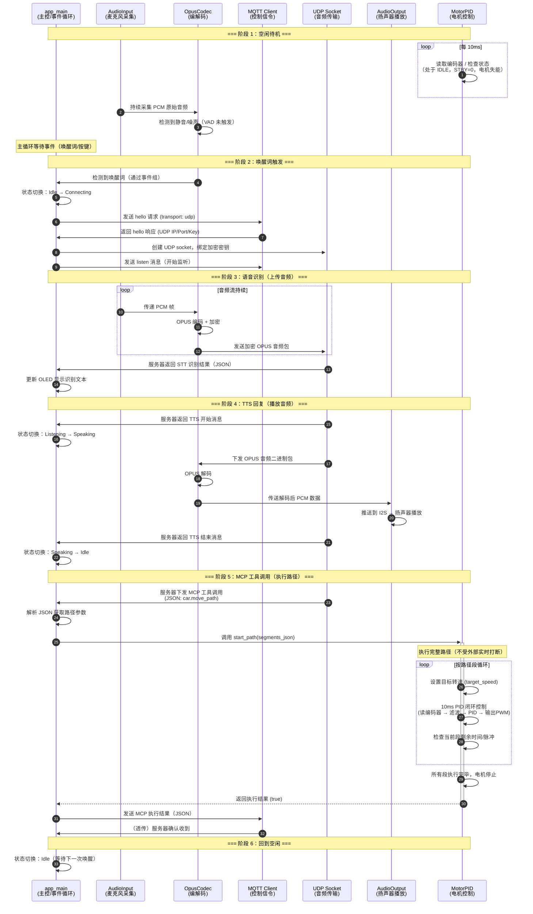
```mermaid
sequenceDiagram
    autonumber
    participant App as app_main<br>(主控/事件循环)
    participant AudioIn as AudioInput<br>(麦克风采集)
    participant Opus as OpusCodec<br>(编解码)
    participant MQTT as MQTT Client<br>(控制信令)
    participant UDP as UDP Socket<br>(音频传输)
    participant AudioOut as AudioOutput<br>(扬声器播放)
    participant Motor as MotorPID<br>(电机控制)

    Note over App, Motor: === 阶段 1：空闲待机 ===
    loop 每 10ms
        Motor->>Motor: 读取编码器 / 检查状态<br>（处于 IDLE，STBY=0，电机失能）
    end
    AudioIn->>Opus: 持续采集 PCM 原始音频
    Opus->>Opus: 检测到静音/噪声（VAD 未触发）
    Note over App: 主循环等待事件（唤醒词/按键）

    Note over App, Motor: === 阶段 2：唤醒词触发 ===
    Opus->>App: 检测到唤醒词（通过事件组）
    App->>App: 状态切换：Idle → Connecting
    App->>MQTT: 发送 hello 请求 (transport: udp)
    MQTT->>App: 返回 hello 响应 (UDP IP/Port/Key)
    App->>+UDP: 创建 UDP socket，绑定加密密钥
    App->>MQTT: 发送 listen 消息（开始监听）

    Note over App, Motor: === 阶段 3：语音识别（上传音频） ===
    loop 音频流持续
        AudioIn->>Opus: 传递 PCM 帧
        Opus->>Opus: OPUS 编码 + 加密
        Opus->>UDP: 发送加密 OPUS 音频包
    end
    UDP->>App: 服务器返回 STT 识别结果（JSON）
    App->>App: 更新 OLED 显示识别文本

    Note over App, Motor: === 阶段 4：TTS 回复（播放音频） ===
    UDP->>App: 服务器返回 TTS 开始消息
    App->>App: 状态切换：Listening → Speaking
    UDP->>Opus: 下发 OPUS 音频二进制包
    Opus->>Opus: OPUS 解码
    Opus->>AudioOut: 传送解码后 PCM 数据
    AudioOut->>AudioOut: 推送到 I2S → 扬声器播放
    UDP->>App: 服务器返回 TTS 结束消息
    App->>App: 状态切换：Speaking → Idle

    Note over App, Motor: === 阶段 5：MCP 工具调用（执行路径） ===
    UDP->>App: 服务器下发 MCP 工具调用<br>(JSON: car.move_path)
    App->>App: 解析 JSON 获取路径参数
    App->>+Motor: 调用 start_path(segments_json)
    Note over Motor: 执行完整路径（不受外部实时打断）
    loop 按路径段循环
        Motor->>Motor: 设置目标转速 (target_speed)
        Motor->>Motor: 10ms PID 闭环控制<br>(读编码器 → 滤波 → PID → 输出PWM)
        Motor->>Motor: 检查当前段剩余时间/脉冲
    end
    Motor->>Motor: 所有段执行完毕，电机停止
    Motor-->>-App: 返回执行结果 (true)
    App->>MQTT: 发送 MCP 执行结果（JSON）
    MQTT->>App: （透传）服务器确认收到

    Note over App, Motor: === 阶段 6：回到空闲 ===
    App->>App: 状态切换：Idle（等待下一次唤醒）
```
 
 
 接下来我们逐个分析。

## .github

这个目录包含 GitHub Actions 的 CI/CD 流水线配置文件（如自动编译检查、代码格式检查、自动发布固件），以及 Issue/PR 模板和 CODEOWNERS 文件。这些配置仅服务于 GitHub 仓库的协同开发流程，与本地编译和固件功能无关，二次开发时可以忽略。

## .vscode

这个是 visual studio code 编辑器的项目配置文件目录，不用管。

## build

编译的中间产物，如果执行 `idf.py full clean` 时会删除这个目录。

## docs

项目文档仓库，给开发者阅读的资料。

## managed_components

ESP-IDF 组件管理器自动下载的外部依赖库，不用管。

## partitions

规定了 flash 分区表，包括各个分区的起始地址、大小和用途。
 分区包括：NVS，OTADATA，应用程序分区，文件系统分区等。

我用的是面包板开发，不带摄像头，这个配置一般用 8M 分区表，可以在 `partitions/v2/8m.csv` 里找到。

```
# ESP-IDF Partition Table
# Name,   Type, SubType, Offset,  Size, Flags
nvs,      data, nvs,     0x9000,    0x4000,
otadata,  data, ota,     0xd000,    0x2000,
phy_init, data, phy,     0xf000,    0x1000,
ota_0,    app,  ota_0,   0x20000,   0x2f0000,
ota_1,    app,  ota_1,   ,          0x2f0000,
assets,   data, spiffs,  0x600000,  2M
```

#### nvs Non-Volatile Storage

存储了用户配置和运行时的参数（比如说 ota-url, websocket.url, MQTT 配置, wifi 密码等等）。NVS 中的数据通过键值对（Key-Value）存储，断电后不丢失。**`ota_url` 的优先级高于 `sdkconfig` 中的 `CONFIG_OTA_URL`**，这就是为什么修改 `menuconfig` 后，如果 NVS 中已有 `ota_url`，设备仍会使用旧地址的原因。

#### otadata

这里可以配合文章一开始的时序图看。
可以看出ota是用于从服务器下载新固件的方式。

>**注意**：这里的 ota 是通过 http 请求-响应来执行的。也就是说 ota（on the air）是一个应用层的业务逻辑，指向的是设备通过网络获取新固件并更新的过程；而 HTTP 是一个通信协议，指向的是打包数据包的格式以及传包解包的技术规范。我们去代码里读取 ota 的 url，也可以发现它的头上是 http。


设备上电之后，bootloader 会读取这里。otadata 是一个标记，告诉 bootloader 启动的时候加载 ota_0 还是 ota_1 分区里的固件。

在 ota 升级的时候，新固件会下载到空闲分区。

> 举个例子，如果现在 flash 里的 otadata 字节指向 ota_0，那么升级的时候新固件会下载到 ota_1，然后 otadata 字节会指向 ota_1，下次启动的时候会使用新下载的固件。

> 如何理解固件？
>  ESP32 的固件（Firmware）是一个完整的二进制镜像，就是烧录进ESP32Flash的.bin文件。包含了 FreeRTOS 操作系统、设备驱动、应用程序逻辑等等。它直接运行在硬件之上。

如何修改ota的url？

修改ota的url可以：
 ①让小智连接到你电脑部署的本地服务器上
 ②让电脑作为网关，通过电脑连接到小智云端，在电脑上捕获日志

ota 的 url 可以在 `idf.py menuconfig` 里看到，也可以从 `sdkconfig` 里 `CONFIG_OTA_URL` 看到。

你可以在 `idf.py menuconfig` → `Xiaozhi Configuration` → `OTA URL` 中修改默认的 OTA 服务器地址。这个地址会被编译进固件，作为**后备地址**。

`main/ota.cc` 中的 `Ota::GetCheckVersionUrl()` 函数：

```cpp
std::string Ota::GetCheckVersionUrl() {
    Settings settings("wifi", false);
    std::string url = settings.GetString("ota_url");   // ① 优先从 NVS 读取
    if (url.empty()) {                                 // ② 只有 NVS 中为空时
        url = CONFIG_OTA_URL;                          // ③ 才使用 menuconfig 的默认值
    }
    return url;
}
```

- NVS 中的 `ota_url` 优先级高于 `CONFIG_OTA_URL`**。  
- 当你修改 `menuconfig` 中的 OTA 地址时，`CONFIG_OTA_URL` 会被更新，但 NVS 中仍然存着旧地址。  
- 由于 `url` 不为空，`if(url.empty())` 条件永远为 `false`，你的修改被无视。  
- 执行 `idf.py erase-nvs` 清除 NVS 后，`url` 变为空，代码才会 fallback 到你刚刚修改的 `CONFIG_OTA_URL`。  

因此，如果你希望让新修改的 `CONFIG_OTA_URL` 生效，你需要**清除 NVS 中存储的旧 `ota_url`**。
 要执行以下命令：

```bash
idf.py erase-nvs
```

------

#### assets 分区（SPIFFS）

`assets` 是一个文件系统分区，用于存储 UI 资源，包括屏幕字体、表情图标、背景图片以及唤醒词模型（`srmodels.bin`）。设备可以通过 OTA 方式下载新的资源包并覆盖此分区，实现“云端换肤”和唤醒词升级。

------

## scripts

这个是辅助工具脚本，存放用于自动化构建、代码生成、资源打包等脚本。里面包含一些常用的脚本，例如 `generate_assets.py`（打包 UI 资源）、`ota_build.py`（生成 OTA 固件）等。本次开发不用关注。

------


## `.gitignore`

Git 版本控制忽略文件列表，告诉 Git 哪些文件/目录不需要上传到仓库。通常包含 `build/`、`sdkconfig`、`*.o`、`*.bin` 等编译产物和临时文件。**不需要关注，也不要在生产环境修改，否则可能导致编译产物被错误提交。**

## `.clang-format`

代码格式化配置文件，用于统一 C/C++ 代码风格（缩进、括号换行、空格等）。当你在 VSCode 中按下格式化快捷键时，会依据此规则调整代码。**不需要关注，但如果你希望保持代码风格统一，可以保留。不影响编译结果。**

## `CMakeLists.txt`

项目顶层 CMake 构建文件。定义了项目名称、版本号，并引入 ESP-IDF 的构建系统。该文件会被 `idf.py` 调用，同时它会自动扫描 `main/` 和 `managed_components/` 等子目录并编译。**如果你需要修改全局编译选项，才需要动它。这次我们需要往里面添加。**

## `dependencies.lock`

ESP-IDF 组件管理器（IDF Component Manager）自动生成的依赖锁定文件，记录了所有第三方组件（如 `lvgl`、`cJSON` 等）的精确版本号，确保不同环境下编译时使用相同的依赖版本。**完全不需要关注，自动生成，不要手动修改。**

## `LICENSE`

项目的开源许可证文件（MIT 或 Apache-2.0）。规定了你可以如何用这份代码（商用、修改、分发等）。**代码开发过程中不需要管它。**

## `README.md` / `README_zh.md` / `README_ja.md`

项目的说明文档，分别用英文、中文、日文编写。包含硬件接线说明、编译步骤、配置方法、功能特性等。

## 一系列config文件
### `sdkconfig`

ESP-IDF 的**当前编译配置**文件。由 `idf.py menuconfig` 生成并保存所有配置选项（如 OTA URL、PSRAM 开关、串口波特率等）。该文件会在 `idf.py build` 时被读取。**该文件可以被删除，但删除后需要重新运行 `idf.py menuconfig` 生成新的配置。注意：该文件通常不会被提交到 Git（已在 `.gitignore` 中），所以拉取代码后需要根据你的硬件重新配置。**

### `sdkconfig.defaults`

全局默认配置模板。如果 `sdkconfig` 文件不存在，构建系统会从这个文件复制一份作为初始配置。通常包含项目最基础的默认值。**如果项目提供了这个文件，你可以在第一次编译前直接运行 `idf.py build`，它会自动使用默认配置，无需手动运行 `menuconfig`。但默认配置可能不符合你的硬件，仍建议运行 `menuconfig` 调整。**

### `sdkconfig.defaults.esp32`

针对 **ESP32（非 S 系列）** 芯片的默认配置模板。当目标芯片为 ESP32 时，构建系统会优先使用此文件（如果 `sdkconfig` 不存在）。**如果你用的是 ESP32-S3 或 ESP32-C3，则此文件不会生效。无需关注。**

### `sdkconfig.defaults.esp32c3`

针对 **ESP32-C3（RISC-V 架构）** 芯片的默认配置模板。**如果你用的是 ESP32-C3 开发板，此文件会在第一次编译时作为默认配置。其它芯片则忽略。**

### `sdkconfig.defaults.esp32c5`

针对 **ESP32-C5（WiFi 6 / 蓝牙 5.0）** 芯片的默认配置模板。**目前小智项目对 C5 的支持还在早期阶段，除非你用 C5 芯片，否则无需关注。**

### `sdkconfig.defaults.esp32c6`

针对 **ESP32-C6（WiFi 6 / 蓝牙 5.3 / 802.15.4）** 芯片的默认配置模板。**如果你用的是 C6 芯片，此文件会在初次编译时被使用。其它芯片无需关注。**

### `sdkconfig.defaults.esp32p4`

针对 **ESP32-P4（高性能 AI 应用芯片）** 的默认配置模板。**目前小智项目对 P4 的支持刚刚起步，除非你用的是 P4 芯片，否则完全忽略。**

### `sdkconfig.defaults.esp32s3`

针对 **ESP32-S3（你正在使用的芯片）** 的默认配置模板。该文件包含了针对 ESP32-S3 的默认引脚映射、PSRAM 设置、音频采样率等配置。**如果你用的是 ESP32-S3，第一次编译时会自动使用这个默认配置。如果你在 `menuconfig` 中修改了配置并保存，后续会使用 `sdkconfig` 而忽略此文件。**

### `sdkconfig.old`

上一次 `idf.py menuconfig` 修改之前的 `sdkconfig` 备份文件。如果你在 `menuconfig` 中改坏了配置，可以手动将 `sdkconfig.old` 复制为 `sdkconfig` 以恢复之前的配置。**如果你不小心改坏了配置导致编译失败，可以用这个文件快速恢复。**


## main

main这里我先给出每个目录的大致作用，然后我会按照初始化和状态机这两个路径来学习。

#### 各模块职责


| 模块                           | 职责                                        |
| ---------------------------- | ----------------------------------------- |
| `Board`                      | 单例，管理硬件实例（Display、AudioCodec、Led、Network） |
| `Display`                    | UI 渲染，状态栏、聊天消息、表情                         |
| `AudioService`               | 音频采集/编码/解码/播放，VAD，唤醒词检测                   |
| `Protocol`                   | 网络协议（MQTT/WebSocket），音频通道管理，JSON 指令收发     |
| `Ota`                        | 版本检查、固件/资源升级                              |
| `McpServer`                  | MCP 工具注册与消息处理                             |
| `Settings`                   | NVS 分区读写接口，存取 `ota_url`、WiFi 密码等配置        |
| `Assets`                     | `assets` 分区的资源下载、挂载和管理                    |
| `SystemInfo`                 | 设备信息获取（固件版本、芯片型号、内存状态等）                   |
| `main.cc`                    | 程序入口，调用 `app.Initialize()` 和 `app.Run()`  |
| `application.cc/.h`          | 业务逻辑核心，状态机驱动、事件调度                         |
| `device_state_machine.cc/.h` | 状态迁移管理、观察者模式、线程安全                         |
| `device_state.h`             | 设备状态枚举定义（`DeviceState`）                   |
| `CMakeLists.txt`             | 编译配置文件，定义哪些源文件参与编译                        |
| `Kconfig.projbuild`          | `menuconfig` 菜单选项定义源                      |
| `idf_component.yml`          | 组件依赖声明，自动生成，无需手动修改                        |
| `boards/` 目录                 | 硬件抽象层：各开发板的引脚配置和初始化                       |
| `display/` 目录                | 显示驱动实现（OLED/LCD/LVGL 等）                   |
| `audio/` 目录                  | 音频编解码器实现                                  |
| `protocols/` 目录              | 网络协议实现（WebSocket / MQTT）                  |
| `led/` 目录                    | LED 指示灯控制                                 |

#### MCP Server 详解


MCP（Model Context Protocol）是整个小智系统中 **业务逻辑暴露给 AI 的统一入口**。

**为什么需要 MCP？**

传统语音助手中，AI 只能进行问答对话，无法操控硬件。MCP 协议定义了一套标准化的工具调用接口：

- AI 通过语音/文本请求执行某个操作
- 小智将请求解析为 MCP 工具调用
- 工具执行完毕后返回结果给 AI
- AI 再组织成自然语言回复用户

这样就实现了 **“你说 → AI 理解 → 执行动作 → AI 回复结果”** 的完整闭环。

>mcpserver的注册在文章开头时序图`app:Initialize()`中的`注册mcp工具`部分。

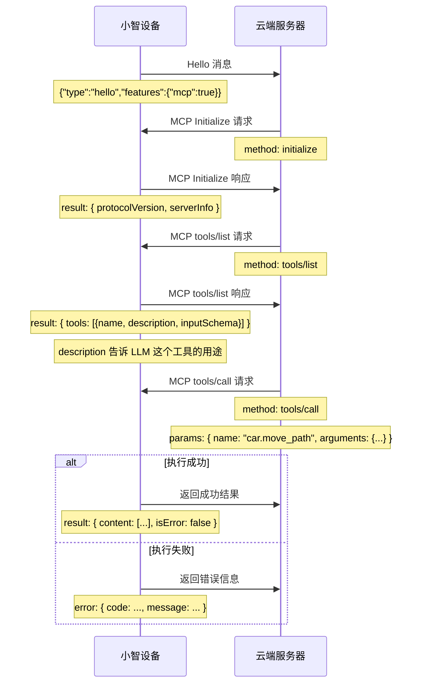
```mermaid
sequenceDiagram
    participant Device as 小智设备
    participant Cloud as 云端服务器

    Device->>Cloud: Hello 消息
    Note over Device: {"type":"hello","features":{"mcp":true}}

    Cloud->>Device: MCP Initialize 请求
    Note over Cloud: method: initialize

    Device->>Cloud: MCP Initialize 响应
    Note over Device: result: { protocolVersion, serverInfo }

    Cloud->>Device: MCP tools/list 请求
    Note over Cloud: method: tools/list

    Device->>Cloud: MCP tools/list 响应
    Note over Device: result: { tools: [{name, description, inputSchema}] }
    Note over Device: description 告诉 LLM 这个工具的用途

    Cloud->>Device: MCP tools/call 请求
    Note over Cloud: method: tools/call
    Note over Cloud: params: { name: "car.move_path", arguments: {...} }

    alt 执行成功
        Device->>Cloud: 返回成功结果
        Note over Device: result: { content: [...], isError: false }
    else 执行失败
        Device->>Cloud: 返回错误信息
        Note over Device: error: { code: ..., message: ... }
    end
```

**工具的注册**

在设备端，工具通过 `McpServer` 单例注册。以小车控制为例，在 `CarController` 的构造函数中注册了 4 个工具：

```cpp
auto& server = McpServer::GetInstance();

server.AddTool("car.move_path", 
    "Execute one or more continuous movement segments...",  // ← description
    PropertyList({ Property("segments", kPropertyTypeString) }),
    [this](const PropertyList& props) -> ReturnValue { ... });

server.AddTool("car.stop",
    "Stop the car immediately...",                          // ← description
    PropertyList(),
    [this](const PropertyList&) -> ReturnValue { ... });
```

**`description` 是关键**。每个工具都有一句自然语言描述，LLM 在收到 `tools/list` 返回的列表后，根据这些描述判断当前任务应该调用哪个工具。比如用户说“停车”，LLM 看到 `car.stop` 的 description 是“立即停止所有运动”，就知道该用这个工具。


下图展示的是 MCP 工具调用的**完整执行路径**——从用户说话到小车运动的代码级调用链：

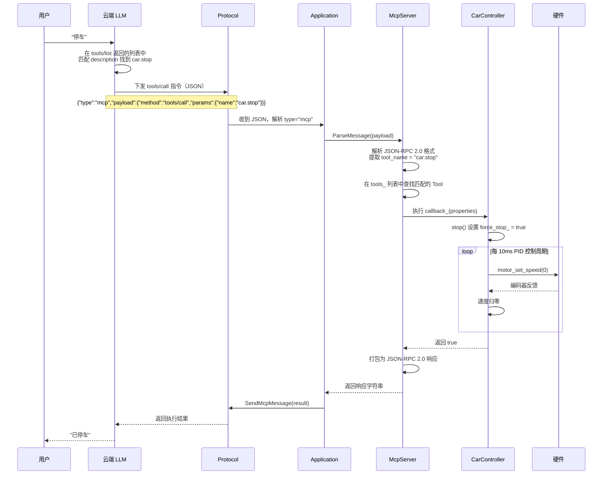
```mermaid
sequenceDiagram
    participant User as 用户
    participant LLM as 云端 LLM
    participant Proto as Protocol
    participant App as Application
    participant MCP as McpServer
    participant Tool as CarController
    participant Hw as 硬件

    User->>LLM: "停车"
    LLM->>LLM: 在 tools/list 返回的列表中<br>匹配 description 找到 car.stop
    LLM->>Proto: 下发 tools/call 指令（JSON）
    Note over LLM,Proto: {"type":"mcp","payload":{"method":"tools/call","params":{"name":"car.stop"}}}

    Proto->>App: 收到 JSON，解析 type="mcp"
    App->>MCP: ParseMessage(payload)

    MCP->>MCP: 解析 JSON-RPC 2.0 格式<br>提取 tool_name = "car.stop"
    MCP->>MCP: 在 tools_ 列表中查找匹配的 Tool

    MCP->>Tool: 执行 callback_(properties)
    Tool->>Tool: stop() 设置 force_stop_ = true

    loop 每 10ms PID 控制周期
        Tool->>Hw: motor_set_speed(0)
        Hw-->>Tool: 编码器反馈
        Tool->>Tool: 速度归零
    end

    Tool-->>MCP: 返回 true
    MCP->>MCP: 打包为 JSON-RPC 2.0 响应
    MCP-->>App: 返回响应字符串
    App->>Proto: SendMcpMessage(result)
    Proto-->>LLM: 返回执行结果
    LLM-->>User: "已停车"
```


MCP Server 负责管理所有可被 AI 调用的工具，是整个小智系统中 **业务逻辑暴露给 AI 的统一入口**。

为什么需要 MCP？

在传统语音助手中，AI 只能进行问答对话，无法操控硬件。MCP 协议定义了一套标准化的工具调用接口：

- AI 通过语音/文本请求执行某个操作（如“向前走 2 米”）
- 小智将请求解析为 MCP 工具调用
- 工具执行完毕后返回结果给 AI
- AI 再组织成自然语言回复用户

这样就实现了 **“你说 → AI 理解 → 执行动作 → AI 回复结果”** 的完整闭环。

以下是从用户语音指令到小车执行动作的完整 MCP 完整流程：

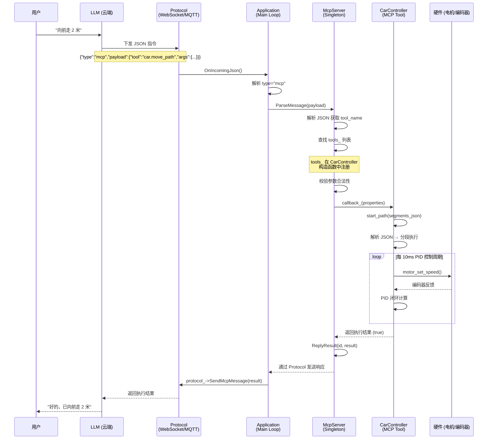
```mermaid
sequenceDiagram
    participant User as 用户
    participant AI as LLM (云端)
    participant Proto as Protocol<br>(WebSocket/MQTT)
    participant App as Application<br>(Main Loop)
    participant MCP as McpServer<br>(Singleton)
    participant Tool as CarController<br>(MCP Tool)
    participant Hw as 硬件 (电机/编码器)

    User->>AI: "向前走 2 米"
    AI->>Proto: 下发 JSON 指令
    Note over AI,Proto: {"type":"mcp","payload":{"tool":"car.move_path","args":{...}}}

    Proto->>App: OnIncomingJson()
    App->>App: 解析 type="mcp"
    App->>MCP: ParseMessage(payload)

    MCP->>MCP: 解析 JSON 获取 tool_name
    MCP->>MCP: 查找 tools_ 列表
    Note over MCP: tools_ 在 CarController<br>构造函数中注册

    MCP->>MCP: 校验参数合法性
    MCP->>Tool: callback_(properties)

    Tool->>Tool: start_path(segments_json)
    Tool->>Tool: 解析 JSON → 分段执行
    loop 每 10ms PID 控制周期
        Tool->>Hw: motor_set_speed()
        Hw-->>Tool: 编码器反馈
        Tool->>Tool: PID 闭环计算
    end

    Tool-->>MCP: 返回执行结果 (true)
    MCP->>MCP: ReplyResult(id, result)
    MCP-->>App: 通过 Protocol 发送响应
    App->>Proto: protocol_->SendMcpMessage(result)
    Proto-->>AI: 返回执行结果
    AI-->>User: "好的，已向前走 2 米"
```


#### `boards/` 硬件抽象层

这里boards比较重要，我详细研究了一下。

它是小智项目中的硬件抽象层。它的作用是把不同开发板的硬件差异（引脚编号、外设型号、初始化时序）封装起来，向上层（`Application`、`AudioService`、`Display` 等）提供一套统一的接口。

`Application` 只需要调用 `Board::GetInstance().GetDisplay()`，不需要关心底层用的是 SSD1306 OLED 还是 ILI9341 LCD，也不需要知道屏幕的 I2C 地址或 SPI 引脚接在 GPIO 几号口。这种设计让项目可以支持几十种不同的开发板，而核心业务代码（`application.cc`、`ota.cc`、`mcp_server.cc`）完全不需要改动。

`boards/` 目录下的每个子目录对应一种具体的开发板型号（如 `bread-compact-wifi`、`esp32-s3-box`、`esp32-c3-DevKit` 等），每个子目录里通常包含以下几个文件：

| 文件                  | 作用                                                                                    |
| ------------------- | ------------------------------------------------------------------------------------- |
| **`config.h`**      | **引脚配置文件**：用宏定义把所有 GPIO 引脚编号、I2C 地址、屏幕分辨率、音频采样率等硬件参数固化下来。                             |
| **`xxxx_board.cc`** | **板级支持包（BSP）主文件**：继承 `Board` 基类，实现具体的硬件初始化函数（如屏幕初始化、音频 Codec 初始化、按键绑定等）和mcptools注册函数。 |
| **`config.json`**   | **元数据描述文件**（可选）：用于网页配网门户识别板型，描述板子的名称、芯片型号、屏幕尺寸等信息。                                    |
| **自定义扩展文件**         | 如 `car_controller.h`（用户自行添加的小车控制）、`lamp_controller.h` 等，用于板载特殊硬件的控制逻辑。                |

------

##### 以 `bread-compact-wifi` 为例详解

`bread-compact-wifi` 是小智官方为“面包板紧凑型 WiFi 开发板”设计的板型，它基于 ESP32-S3 芯片，配备 I2S 数字麦克风、SSD1306 OLED 屏幕、MAX98357 音频功放以及多个按键。我们逐一拆解它的文件：

###### `config.h`

`config.h` 是这块板子的*接线说明*，它用宏定义把所有硬件连接关系固化下来。例如：

```cpp
#ifndef _BOARD_CONFIG_H_
#define _BOARD_CONFIG_H_
#include <driver/gpio.h>
#define AUDIO_INPUT_SAMPLE_RATE  16000
#define AUDIO_OUTPUT_SAMPLE_RATE 24000
// 如果使用 Duplex I2S 模式，请注释下面一行
#define AUDIO_I2S_METHOD_SIMPLEX
#ifdef AUDIO_I2S_METHOD_SIMPLEX
#define AUDIO_I2S_MIC_GPIO_WS   GPIO_NUM_4
#define AUDIO_I2S_MIC_GPIO_SCK  GPIO_NUM_5
#define AUDIO_I2S_MIC_GPIO_DIN  GPIO_NUM_6
#define AUDIO_I2S_SPK_GPIO_DOUT GPIO_NUM_7
#define AUDIO_I2S_SPK_GPIO_BCLK GPIO_NUM_15
#define AUDIO_I2S_SPK_GPIO_LRCK GPIO_NUM_16 
#else
#define AUDIO_I2S_GPIO_WS GPIO_NUM_4
#define AUDIO_I2S_GPIO_BCLK GPIO_NUM_5
#define AUDIO_I2S_GPIO_DIN  GPIO_NUM_6
#define AUDIO_I2S_GPIO_DOUT GPIO_NUM_7
#endif
#define BUILTIN_LED_GPIO        GPIO_NUM_48
#define BOOT_BUTTON_GPIO        GPIO_NUM_0
#define TOUCH_BUTTON_GPIO       GPIO_NUM_47
#define VOLUME_UP_BUTTON_GPIO   GPIO_NUM_40
#define VOLUME_DOWN_BUTTON_GPIO GPIO_NUM_39
#define DISPLAY_SDA_PIN GPIO_NUM_41
#define DISPLAY_SCL_PIN GPIO_NUM_42
#define DISPLAY_WIDTH   128
#if CONFIG_OLED_SSD1306_128X32
#define DISPLAY_HEIGHT  32
#elif CONFIG_OLED_SSD1306_128X64
#define DISPLAY_HEIGHT  64
#elif CONFIG_OLED_SH1106_128X64
#define DISPLAY_HEIGHT  64
#define SH1106
#else
#error "OLED display type is not selected"
#endif
#define DISPLAY_MIRROR_X true
#define DISPLAY_MIRROR_Y true
// A MCP Test: Control a lamp
//#define LAMP_GPIO GPIO_NUM_18
#endif // _BOARD_CONFIG_H_
```

**关键点**：

- 所有引脚编号都被宏名称抽象化（如 `MIC_GPIO_WS` 代替 `GPIO_NUM_4`），上层代码完全看不到具体数字。
- 如果换了另一种屏幕（比如从 SSD1306 换成 SH1106），只需要在这里改 `DISPLAY_HEIGHT` 和添加 `#define SH1106`，`display/` 目录下的驱动代码会自动适配。

------

###### `compact_wifi_board.cc`

这是板级支持包的核心文件，它实现了 `CompactWifiBoard` 类，继承自 `WifiBoard`。它的主要工作包括：

**A. 屏幕初始化**

```cpp
void InitializeSsd1306Display() {
    i2c_master_bus_config_t bus_config = {
        .i2c_port = (i2c_port_t)0,
        .sda_io_num = DISPLAY_SDA_PIN,
        .scl_io_num = DISPLAY_SCL_PIN,
        // ...
    };
    i2c_new_master_bus(&bus_config, &display_i2c_bus_);
    // 配置 I2C 设备地址（0x3C），创建 LVGL 显示对象
    display_ = new OledDisplay(panel_io_, panel_, DISPLAY_WIDTH, DISPLAY_HEIGHT, ...);
}
```

**B. 按键事件绑定**

```cpp
void InitializeButtons() {
    boot_button_.OnClick([this]() {
        app.ToggleChatState();  // 单击切换对话状态
    });
    touch_button_.OnPressDown([this]() {
        app.StartListening();   // 按下开始聆听
    });
    touch_button_.OnPressUp([this]() {
        app.StopListening();    // 松开停止聆听
    });
    // 音量按键绑定
}
```

**C. 硬件工具注册（MCP）**

这里原来是一个lampcontrol的工具【加链接】，我的代码里添加了这个carcontroll。

```cpp
void InitializeTools() {
    // 实例化小车控制器（用户自定义）
    static CarController car(
        GPIO_NUM_17, GPIO_NUM_18, GPIO_NUM_8,  // 左轮 IN1/IN2/PWM
        GPIO_NUM_9,  GPIO_NUM_10, GPIO_NUM_13, // 右轮 IN1/IN2/PWM
        GPIO_NUM_14,                           // STBY
        GPIO_NUM_1,  GPIO_NUM_2,               // 左轮编码器 A/B
        GPIO_NUM_11, GPIO_NUM_12               // 右轮编码器 A/B
    );
}
```

**D. 覆盖基类的虚函数**

```cpp
virtual Led* GetLed() override {
    static SingleLed led(BUILTIN_LED_GPIO);
    return &led;
}

virtual AudioCodec* GetAudioCodec() override {
    static NoAudioCodecDuplex audio_codec(...);
    return &audio_codec;
}

virtual Display* GetDisplay() override {
    return display_;
}
```

**关键点**：

- 所有硬件对象（屏幕、音频编解码器、LED）都采用**懒加载单例**模式（`static` 局部变量），确保在整个程序生命周期内只初始化一次。
- `InitializeTools()` 是注册 MCP 工具的官方入口（如小车控制、灯光控制等），用户自定义的硬件工具应放在这里。

------

###### `config.json`

这个 JSON 文件用于**手机配网门户**（当设备进入 AP 模式时，手机浏览器访问 `192.168.4.1` 会显示一个配置页面），它告诉配网门户该板子的基本信息：

```json
{
  "name": "Bread Compact WiFi",
  "type": "esp32s3",
  "display": {
    "type": "oled",
    "width": 128,
    "height": 64
  }
}
```

配网门户会根据这个信息显示对应的板子名称和图标，方便用户识别。

------

###### `car_controller.h`

这个文件是我在二次开发中添加的，**不属于官方代码**。它实现了小车电机的 PID 控制、编码器读取和 MCP 工具注册（`car.move_path`、`car.stop` 等）。如果以后加其他的mcp工具也应该放在这里。如果自己写了调用函数的文件可以放在car_controller.h同级目录下。

------


#### DeviceStateMachine详解

`device_state_machine.cc` 是一个独立的状态管理组件。我认为这里设计的很好，值得学习一下，有以下几个要点：

**① 状态迁移管理**

- 对外提供 `TransitionTo()`（public），触发状态切换
- 内部通过 `IsValidTransition()`（private）校验迁移合法性

**② 观察者模式**

- `AddStateChangeListener()` / `RemoveStateChangeListener()` 管理监听器
- `NotifyStateChange()` 通知所有订阅者状态已变化
- 需要监听状态的模块可自由订阅（如 Display、Led）

**③ 线程安全**

- 使用 `std::atomic` 保证状态读写的原子性
- 读写操作通过 `std::mutex` 保护

**④ 状态机与状态处理解耦**

- 状态机的职责仅限于 **管理状态迁移**（合法性校验 + 变更通知）
- 状态机的转化条件和每个状态的具体业务逻辑在application.cc里面统一处理

接下来我们结合代码逻辑详解一下。
##### **状态定义**

```cpp
enum DeviceState {
    kDeviceStateUnknown,
    kDeviceStateStarting,
    kDeviceStateWifiConfiguring,
    kDeviceStateAudioTesting,
    kDeviceStateActivating,
    kDeviceStateUpgrading,
    kDeviceStateIdle,
    kDeviceStateConnecting,
    kDeviceStateListening,
    kDeviceStateSpeaking
};
```

#####  状态处理

状态的具体业务逻辑定义在 `applicatioon.cc` 中。

###### Event

代码里定义了13个EVENT位。

```cpp
  
    const EventBits_t ALL_EVENTS =

        MAIN_EVENT_SCHEDULE |

        MAIN_EVENT_SEND_AUDIO |

        MAIN_EVENT_WAKE_WORD_DETECTED |

        MAIN_EVENT_VAD_CHANGE |

        MAIN_EVENT_CLOCK_TICK |

        MAIN_EVENT_ERROR |

        MAIN_EVENT_NETWORK_CONNECTED |

        MAIN_EVENT_NETWORK_DISCONNECTED |

        MAIN_EVENT_TOGGLE_CHAT |

        MAIN_EVENT_START_LISTENING |

        MAIN_EVENT_STOP_LISTENING |

        MAIN_EVENT_ACTIVATION_DONE |

        MAIN_EVENT_STATE_CHANGED;
```
 
 
 Event 是硬件/系统层面的即时通知，所谓event就是被动的，是某一个事情发生了，然后esp32要去响应这个事件。


所有 Event 在主循环中被 **串行、顺序** 处理，保证了状态机操作的原子性。

以下是EVENT速览：

| Event Bit                         | 设置者（来源）                                         | 触发场景            |
| --------------------------------- | ----------------------------------------------- | --------------- |
| `MAIN_EVENT_SEND_AUDIO`           | `audio_service_` 的回调 `on_send_queue_available`  | 音频编码队列有数据待发送    |
| `MAIN_EVENT_WAKE_WORD_DETECTED`   | `audio_service_` 的回调 `on_wake_word_detected`    | 本地唤醒词被检测到       |
| `MAIN_EVENT_VAD_CHANGE`           | `audio_service_` 的回调 `on_vad_change`            | VAD（语音活动检测）状态变化 |
| `MAIN_EVENT_CLOCK_TICK`           | `clock_timer_handle_` 的定时器回调（`esp_timer`）       | 每秒一次的心跳时钟       |
| `MAIN_EVENT_NETWORK_CONNECTED`    | `board.SetNetworkEventCallback()` 注册的回调         | WiFi/蜂窝网络连接成功   |
| `MAIN_EVENT_NETWORK_DISCONNECTED` | 同上                                              | WiFi/蜂窝网络断开     |
| `MAIN_EVENT_ERROR`                | `protocol_->OnNetworkError()` 注册的回调             | 网络/协议层发生错误      |
| `MAIN_EVENT_STATE_CHANGED`        | `state_machine_.AddStateChangeListener()` 注册的回调 | 状态机发生任何状态切换     |
| `MAIN_EVENT_TOGGLE_CHAT`          | 外部调用 `ToggleChatState()`                        | 用户按下对话键         |
| `MAIN_EVENT_START_LISTENING`      | 外部调用 `StartListening()`                         | 外部请求开始监听（如 MCP） |
| `MAIN_EVENT_STOP_LISTENING`       | 外部调用 `StopListening()`                          | 外部请求停止监听        |
| `MAIN_EVENT_ACTIVATION_DONE`      | `ActivationTask()` 任务内部                         | 激活任务全部完成        |
| `MAIN_EVENT_SCHEDULE`             | `Schedule()` 函数内部                               | 有异步任务需要投递到主循环执行 |

有一些EVENT有对应的Handlexxx()函数。Handlexxx() 函数可能会调用Device_State_machine里的setDeviceState()函数切换状态，并且调用工具函数完成具体操作。

注意这里是可能会调用，因为不一定所有的Event都会引起State的变化。

>其实如果我们仔细观察代码可以发现，并不是所有的Event都有Handle函数：
>比如说：
>```cpp
if (bits & MAIN_EVENT_ERROR) {
>
            SetDeviceState(kDeviceStateIdle);
>
            Alert(Lang::Strings::ERROR, last_error_message_.c_str(), "circle_xmark", Lang::Sounds::OGG_EXCLAMATION);
>
        }
>```
>我认为可以理解为：这些Event的处理比较简单，都只有两三行代码，不需要封装成一个handle函数，只是这样子的话格式不太统一。


Event与State的关联：
```
Event（事件）→ Handle 函数 → SetDeviceState() → 状态转换
```

>例如 `HandleToggleChatEvent` 中调用：
>- `setDeviceState()`：切换状态
>- `ContinueOpenAudioChannel()`：打开音频通道
>- `SetListeningMode()`：设置监听模式并切换状态
>- `AbortSpeaking()`：打断播报

着重提一下两个EVENT：
1. `HandleStateChangedEvent`

这个函数在每次状态切换后被调用，负责 **状态切换的副作用处理**：

```cpp
switch (new_state) {
    case kDeviceStateIdle:
        display->SetStatus("Standby");
        display->SetEmotion("neutral");
        audio_service_.EnableVoiceProcessing(false);
        audio_service_.EnableWakeWordDetection(true);
        break;
    case kDeviceStateListening:
        display->SetStatus("Listening");
        protocol_->SendStartListening(listening_mode_);
        audio_service_.EnableVoiceProcessing(true);
        break;
    case kDeviceStateSpeaking:
        display->SetStatus("Speaking");
        audio_service_.EnableVoiceProcessing(false);
        break;
    // ...
}
```

> 它不修改状态，只负责 **响应状态变化**。

2. `MAIN_EVENT_SCHEDULE` 
这个EVENT配合Schedule()函数使用。
`Schedule()` 用于把任务加入 `main_tasks_` 队列：

```cpp
void Application::Schedule(std::function<void()>&& callback) {
    {
        std::lock_guard<std::mutex> lock(mutex_);
        main_tasks_.push_back(std::move(callback));
    }
    xEventGroupSetBits(event_group_, MAIN_EVENT_SCHEDULE);
}
```

在主循环中，当捕获到 `MAIN_EVENT_SCHEDULE` 时：

```cpp
if (bits & MAIN_EVENT_SCHEDULE) {
    std::unique_lock<std::mutex> lock(mutex_);
    auto tasks = std::move(main_tasks_);  // 移动取走，不阻塞后续投递
    lock.unlock();
    for (auto& task : tasks) {
        task();  // 依次执行
    }
}
```

**设计精巧之处**：

- 锁的持有时间极短（仅移动队列），不会多占用锁
- 释放锁后再执行任务，投递新任务不阻塞


配一个图结合理解：

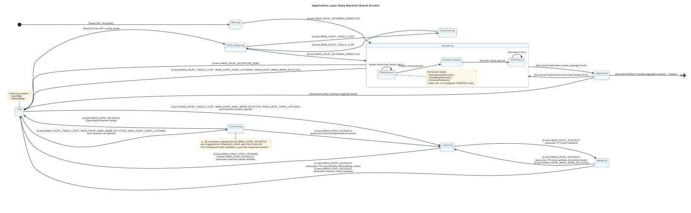

>`ActivationTask` 是**架构中唯一打破“事件驱动规则”的特殊存在**。它不是通过主循环的事件机制驱动的，而是一个独立跑起来的 FreeRTOS Task，里面调了 `SetDeviceState`。

###### 我的错误认知

**这里补充以下我在学习这部分时产生的误解，可能对你产生帮助：**

*Event 和 Task 到底是什么关系？*

  **一开始我的认知是这样的：**

  我观察到 `Run()` 主循环里有两种东西在驱动状态变化（即调用`setDeviceState()`）：

1. 在对于Event位的响应中
2. 在调用task队列的时候

于是我以为：**Event 是一条驱动路径，Task 是另一条驱动路径，两者是平行的。**
类似于这样：

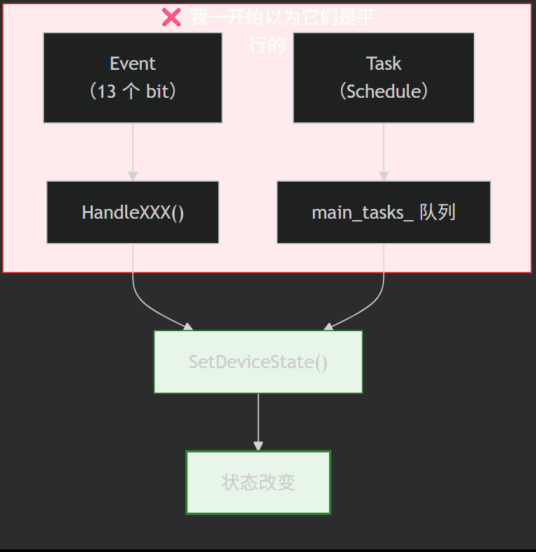

后来我重新审视了 `MAIN_EVENT_SCHEDULE` 这个 Event Bit 本身。

`Schedule()` 函数长这样：

```cpp
void Application::Schedule(std::function<void()>&& callback) {
    {
        std::lock_guard<std::mutex> lock(mutex_);
        main_tasks_.push_back(std::move(callback));
    }
    xEventGroupSetBits(event_group_, MAIN_EVENT_SCHEDULE);  // ← 注意这里！
}
```

关键就在最后一行：**`Schedule()` 内部调用了 `xEventGroupSetBits(MAIN_EVENT_SCHEDULE)`**。

也就是说：**Scheduled Task 之所以能被执行，是因为它通过 `Schedule()` 设置了 `MAIN_EVENT_SCHEDULE` 这个 Event Bit。**

所以，**Task 不是独立于 Event 的驱动源，Scheduled Task 只是 `MAIN_EVENT_SCHEDULE` 这个 Event 的“响应内容”——仅此而已。**

**那为什么还要有 `MAIN_EVENT_SCHEDULE` 和 Scheduled Task？**

既然 `MAIN_EVENT_SCHEDULE` 也是一个 Event，为什么不直接在回调里调用 `xEventGroupSetBits(WAKE_WORD_DETECTED)` 之类的，而非要绕一道 `Schedule()`？

答案是：**因为回调函数运行在其他线程中，不能直接操作状态机，但 `Schedule()` 允许它们把“想做的事情”先存到队列里，然后在主任务上下文中安全地串行执行。**

如果没有 `Schedule()`，回调就只能设置现成的 Event Bit，无法传递“这段文字显示到屏幕上”这样带数据的操作。而有了 `Schedule()`，回调可以投递任何 lambda函数——从“显示一句话”到“切换状态”到“重启设备“。

**最终我修正为正确的认知：**

 **小智的状态机只有一种驱动方式：Event 驱动。**

 在 13 个 `MAIN_EVENT_` 中，有 12 个的响应是**固定的 `HandleXXX()` 函数**；剩下 1 个（`MAIN_EVENT_SCHEDULE`）的响应是 **`main_tasks_` 队列中动态投递的 Scheduled Task**。

 Scheduled Task 不是独立于 Event 的“另一种驱动源”。它本质上只是 `MAIN_EVENT_SCHEDULE` 的响应内容——只不过这个响应是动态的、可携带数据的、可异步投递的。

>- **投递（`Schedule` 调用）** 发生在调用者的线程（音频任务、网络任务等），是异步的、非阻塞的。
  >  
>- **执行（lambda 运行）** 发生在 Application 主循环（主任务）中，是同步的、串行的。

 **换句话说：Event 是“信号的唯一来源”，Scheduled Task 只是这个信号的一个“可编程响应器”。**

>回调（运行在非主线程）→ 调用 Schedule() → 投递 Scheduled Task → 
>MAIN_EVENT_SCHEDULE 触发 → 主循环执行 → 安全调用 SetDeviceState()


**最终的架构图应该是这样的：**
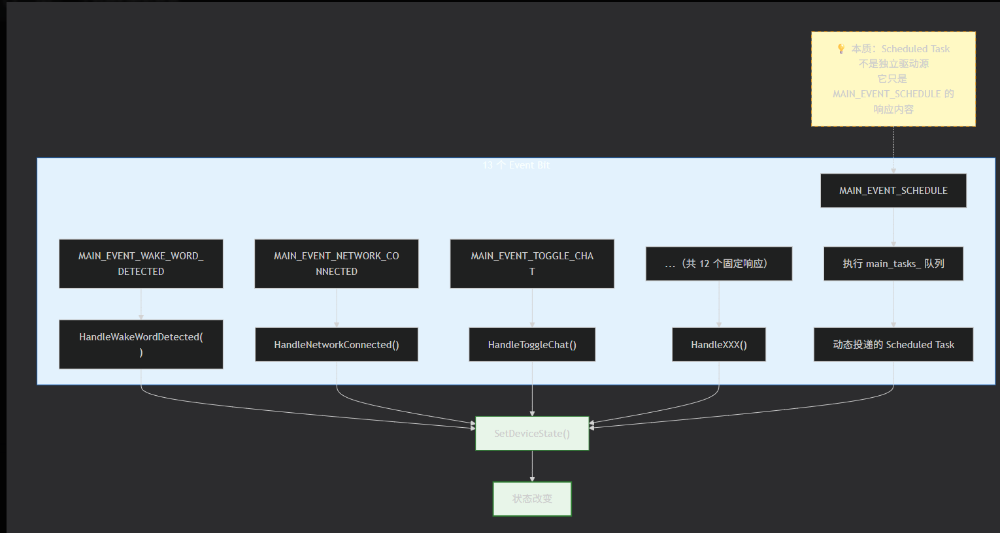

---


# 开发环境

小智项目托管在 GitHub 上，官方主仓库为：

> **[https://github.com/78/xiaozhi-esp32](https://github.com/78/xiaozhi-esp32)**

项目还配有官方服务器和文档：

- **官方服务器**：[https://xiaozhi.me](https://xiaozhi.me)
- **百科全书（飞书文档）**：[《小智 AI 聊天机器人百科全书》](https://ccnphfhqs21z.feishu.cn/wiki/F5krwD16viZoF0kKkvDcrZNYnhb)
- **面包板硬件接线教程**：[飞书云文档](https://ccnphfhqs21z.feishu.cn/wiki/EH6wwrgvNiU7aykr7HgclP09nCh)

小智项目基于 **乐鑫 ESP-IDF** 进行开发。
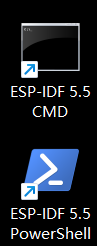

我用的是5.5.4。

以下是常见指令：

```bash
# 1. 克隆项目
git clone https://github.com/78/xiaozhi-esp32.git
cd xiaozhi-esp32


# 2. 设置编译目标（以 ESP32-S3 为例）
idf.py set-target esp32s3

# 3. 配置项目
idf.py menuconfig

# 4. 编译并烧录
idf.py build
idf.py -p <你的串口> flash
idf.py monitor
```


# 正式开始二次开发

## 硬件连线

大部分硬件的接线参考了小智官方方案（https://my.feishu.cn/wiki/EH6wwrgvNiU7aykr7HgclP09nCh）。

接下来是我自己额外加的硬件。

#### 带编码器的直流电机

这个电机是电刷的，不是很高级。
至于加编码器是为了获取电机实际转动的参数，方便引入闭环调节。

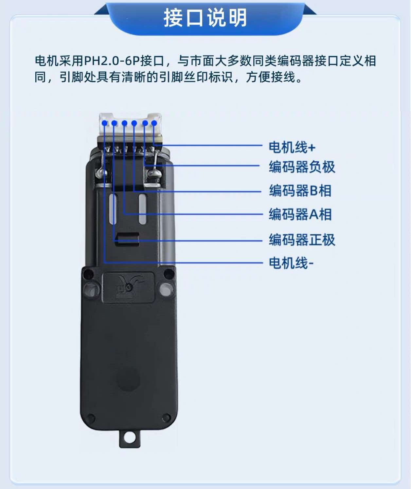

### 电机驱动模块——TB6612FNG

电机驱动我用的是 **TB6612FNG** 模块。相比传统的 L298N，TB6612 发热小、效率高、体积也更紧凑。

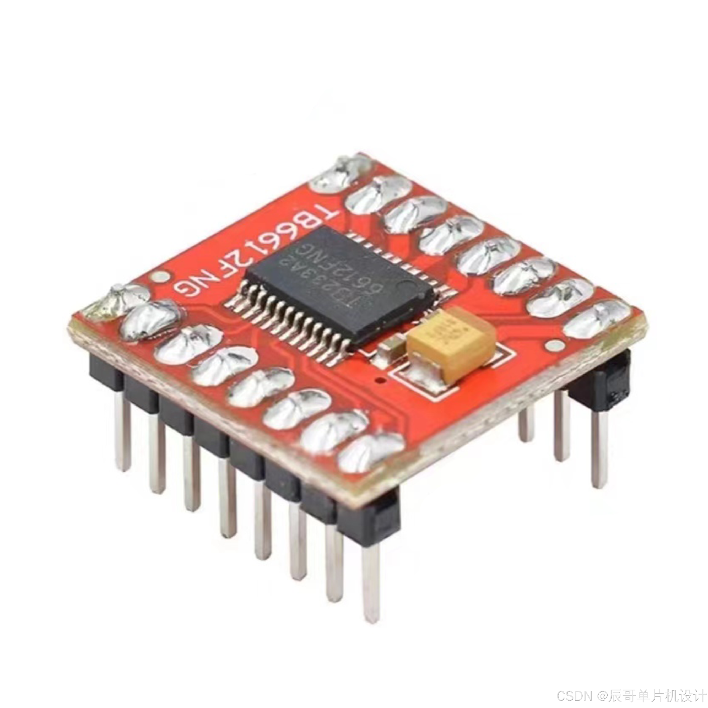

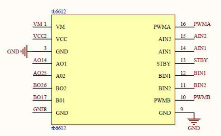

### TB6612FNG 引脚功能表

| 左列引脚（芯片左侧） | 功能说明                             | 右列引脚（芯片右侧） | 功能说明                       |
| ---------- | -------------------------------- | ---------- | -------------------------- |
| **1**      | VM — 电机电源（3.7V~12V）              | **16**     | PWMA — 电机 A 的 PWM 速度控制信号   |
| **2**      | VCC — 逻辑电源（3.3V 或 5V）            | **15**     | AIN2 — 电机 A 方向控制引脚 2       |
| **3**      | GND — 逻辑地                        | **14**     | AIN1 — 电机 A 方向控制引脚 1       |
| **4**      | AO1 — 电机 A 输出引脚 1（接电机 A 的 + 或 -） | **13**     | STBY — 待机控制引脚（高电平使能，低电平待机） |
| **5**      | AO2 — 电机 A 输出引脚 2（接电机 A 的 - 或 +） | **12**     | BIN1 — 电机 B 方向控制引脚 1       |
| **6**      | BO2 — 电机 B 输出引脚 2（接电机 B 的 - 或 +） | **11**     | BIN2 — 电机 B 方向控制引脚 2       |
| **7**      | BO1 — 电机 B 输出引脚 1（接电机 B 的 + 或 -） | **10**     | PWMB — 电机 B 的 PWM 速度控制信号   |
| **8**      | GND — 逻辑地                        | **9**      | GND — 逻辑地                  |

>刚才提到的编码器为什么没有呢，是因为编码器和电机完全解耦的，就是一个转一个测。而引入TB6612FNG是因为单片机的供电带不动两个直流电机，跟编码器没有关系，编码器直接正常接在单片机的引脚上就可以了。

### 供电方案

小智主板和电机驱动需要分开供电（小智是USB或者5VIN引脚供电，TB6612FNG的逻辑电源VCC需要3.3V或者5V，给电机供电的VM需要2.5V~13.5V），我用了两种方案：

##### **方案一：双电源独立供电**

- **小智主板**：通过 USB 供电（5V）
- **TB6612 电机驱动**：通过电池供电（我用的7.4V）

这种方案优点是互不干扰——电机的启停和大电流波动不会影响 ESP32 的稳定运行。缺点是得带两套电源。

##### **方案二：单电源供电**

用7.4V 的电池同时给两者供电：

- 电池（7.4V）→ **NCP1117 降压至 5V** → ESP32 的 5VIN 引脚
- 电池（7.4V）→ 直接给 TB6612 的 VM 供电

>7.4V的电池千万不要直接接到单片机上，会烧。

NCP1117 是一款低压差线性稳压器（LDO），压差约 1.1V，只要输入高于 4.4V 就能稳定输出 3.3V 或 5V。我选的是 **NCP1117ST50T3G（5V 输出版本）** ，输入输出各加一颗电容即可工作。

具体的可以参考规格书。(https://www.onsemi.com/pdf/datasheet/ncp1117-d.pdf)

>Input bypass capacitor Cin may be required for regulator stability if the device is located more than a few inches from the power source. This capacitor will reduce the circuit’s sensitivity when powered from a complex source impedance and significantly enhance the output transient response. The input bypass capacitor should be mounted with the shortest possible track length directly across the regulator’s input and ground terminals. A 10 μF ceramic or tantalum capacitor should be adequate for most applications.
>Frequency compensation for the regulator is provided by capacitor Cout and its use is mandatory to ensure output stability. A minimum capacitance value of 4.7 F with an equivalent series resistance (ESR) that is within the limits of 33 m (typ) to 2.2 is required. See Figures 12 and 13. The capacitor type can be ceramic, tantalum, or aluminum electrolytic as long as it meets the minimum capacitance value and ESR limits over the circuit’s entire operating temperature range. Higher values of output capacitance can be used to enhance loop stability and transient response with the additional benefit of reducing output noise.

根据这个规格书，我选用的是47UF铝电解电容电容。


接线如下：

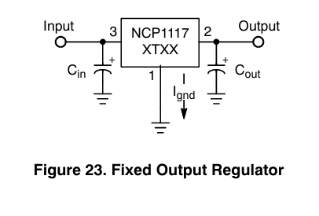


**注意**：这里的4号引脚（就是那个比较大的tab）是用来接散热的，和二号引脚连接在一起。

这里我直接用的元件，然后把插脚式电阻的引脚剪下来焊上去，用来延长引脚，用胶布裹了一圈之后插在面包板上。至今没有断也是神奇。
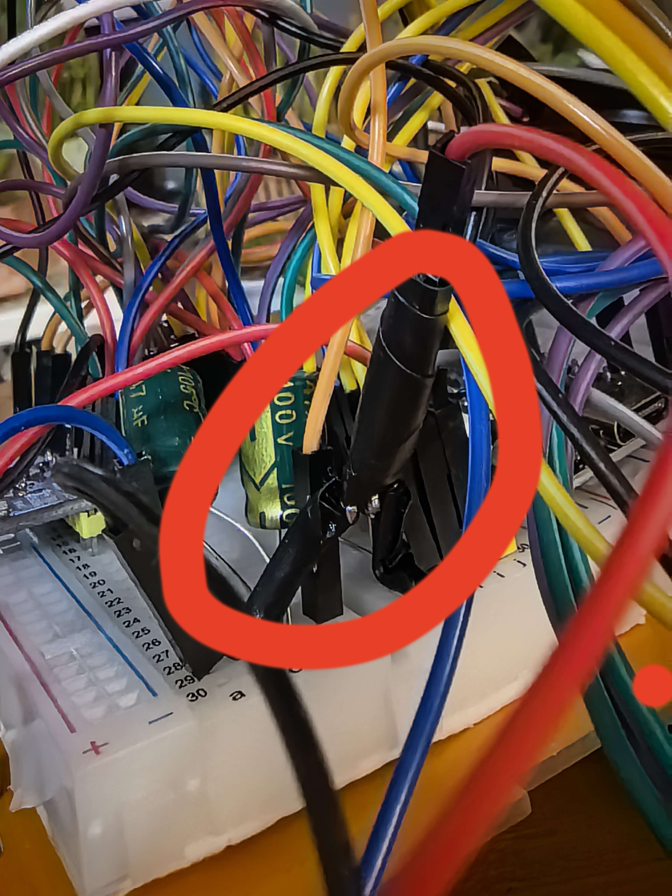

>  **单电源供电的坑**：当电机高功率运行时（如急加速、爬坡、启动、堵转），TB6612 会从电池抽取大电流，导致电池电压瞬间跌落（感觉是因为因为电池有内阻，电流太大的话内阻分压就高）。ESP32 可能会因为供电不足而复位（Brownout）。所以在单电源方案下，理论上建议加一个大电容（如 1000μF）在电池端做储能缓冲（我没加）。实际上，这个复位的事情真的会发生，但是没有很频繁。


### 引脚冲突与解决方案

小智官方的引脚分配把大部分可用 GPIO 都分配给了屏幕（SPI）、麦克风（I2S）、扬声器（I2S）、按键、LED 等模块。而且，ESP32-S3 的一些引脚已经被占用，不能被用作普通 IO**。如果把这些引脚分配给了外设，会导致一直重启或编译错误。

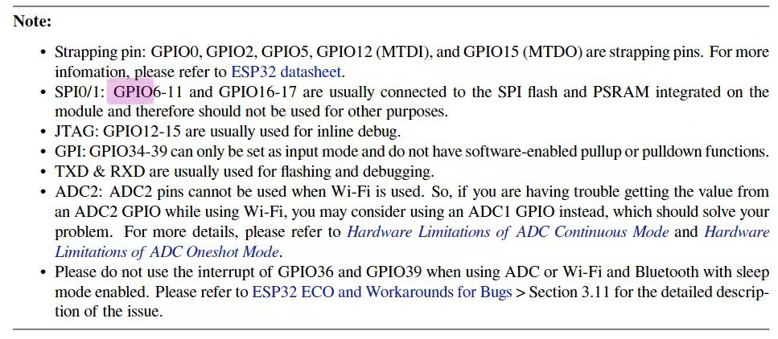

可以查阅手册：extension://ngbkcglbmlglgldjfcnhaijeecaccgfi/https://docs.espressif.com/projects/esp-idf/en/v5.2.6/esp32/esp-idf-en-v5.2.6-esp32.pdf

为了给电机驱动腾出控制引脚，我在 `menuconfig` 中**关闭了 PSRAM**。关闭 PSRAM 后，部分被 PSRAM 占用的引脚得以释放，可供电机驱动使用。

> **注意**：关闭 PSRAM 会减少可用内存，对于复杂的 AI 图像处理可能有影响。建议自行取舍。

具体的引脚哪些可以接哪些不可以接网上没有找到很明确的文档讲述，可以自行试一下，如果有些引脚不能接的话，单片机就会上电之后一直reset，这时候是引脚的问题，不一定是程序的问题。

以下引脚是验证可用的：

| TB6612 引脚   | ESP32-S3 GPIO     | 说明           |
| ----------- | ----------------- | ------------ |
| AIN1        | GPIO17            | 电机 A 方向 1    |
| AIN2        | GPIO18            | 电机 A 方向 2    |
| PWMA        | GPIO8             | 电机 A 速度（PWM） |
| BIN1        | GPIO9             | 电机 B 方向 1    |
| BIN2        | GPIO10            | 电机 B 方向 2    |
| PWMB        | GPIO13            | 电机 B 速度（PWM） |
| STBY        | GPIO14            | 待机控制（高电平使能）  |
| **Encoder** | **ESP32-S3 GPIO** |              |
| ENC A1      | GPIO2             | 第一个电机的编码器    |
| ENC A2      | GPIO37            | 第一个电机的编码器    |
| ENC B1      | GPIO21            | 第二个电机的编码器    |
| ENC B2      | GPIO38            | 第二个电机的编码器    |


## 软件部分

这部分我是模仿一个lampcontroller的例子写的(https://kcn80f4hacgs.feishu.cn/docx/J2MrdqW27oybcCxu7Sfc4gBcn4g?from=from_parent_docx)。

先放一个结构图：
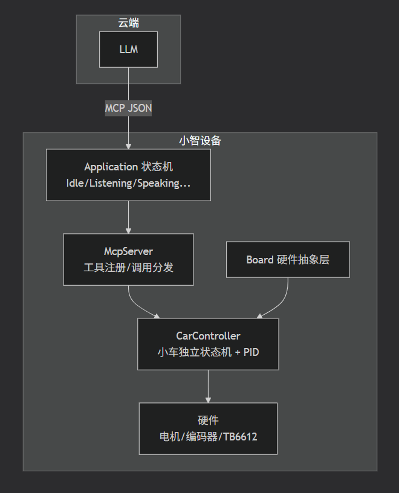

#### 为什么要写 CarController 类？

在完成小智源码的全面解析后，我对 Application 层的状态机架构有了清晰的认识：Application 负责管理设备状态（Idle、Listening、Speaking 等），通过 Event 驱动状态切换，再通过 HandleStateChangedEvent 将状态变化广播给各模块。这个框架非常精巧——**业务逻辑与状态管理分离，各模块通过观察者模式被动响应状态变化**。

但小智原生代码里没有任何关于电机控制的逻辑。如果直接把电机驱动代码塞进 `application.cc`，会严重破坏架构的整洁性。因此，我决定**把小车控制逻辑独立封装成一个 `CarController` 类**：

1. **架构隔离**：CarController 完全独立于 Application 状态机，两者通过 MCP 工具接口通信。Application 不知道电机的存在，CarController 也不知道 UI 或音频的存在。
2. **可复用**：CarController 是一个纯 C++ 类，不依赖小智的任何业务逻辑，未来移植到其他 ESP32-S3 项目只需要修改引脚定义。

**放置位置**：`components/bread-compact_wifi/car_controller.h`

放在 `breadcompact_wifi` 组件中，是因为它属于“板级扩展功能”，与 WiFi/蓝牙等核心通信逻辑平级。同时，后续需要在小智的 Board 初始化流程中注册 MCP 工具。

------

### 在 Board 中集成 CarController

在 `bread-compact-wifi.cc`（即 `Board` 类的实现文件）中，需要做两件事：

**1.引入CarController头文件**

```cpp
// bread-compact-wifi.h
#include "car_controller.h"
```

**2. 在 `InitializeTools()` 函数中实例化 CarController**

`InitializeTools()` 是 Board 初始化流程中专门用于注册 MCP 工具的函数（在 `Initialize()` 中调用 `mcp_server.AddCommonTools()` 和 `mcp_server.AddUserOnlyTools()` 时触发）。我在这个函数里创建 CarController 对象：

```cpp
// breadcompact_wifi.cc

    void InitializeTools() {

        // static LampController lamp(LAMP_GPIO);

        static CarController car(

            GPIO_NUM_17, // IN1_A

            GPIO_NUM_18, // IN2_A

            GPIO_NUM_8, // PWM_A

            GPIO_NUM_9, // IN1_B

            GPIO_NUM_10, // IN2_B

            GPIO_NUM_13, // PWM_B

            GPIO_NUM_14,  // STBY

            GPIO_NUM_2,  // ENC A1

            GPIO_NUM_37,  // ENC A2

            GPIO_NUM_21, // ENC B1

            GPIO_NUM_38  // ENC B2

        );

    }
```

> **关键点**：CarController 的构造函数内部会调用 `McpServer::GetInstance().AddTool()` 自动注册所有 MCP 工具（`car.set_speed_pid`、`car.set_position_pid`、`car.stop`、`car.move_path`），所以在 Board 层只需要实例化，不需要额外手动注册。

------

### CarController 代码结构分析

整个 CarController 采用**分层架构**，从底层硬件到高层业务逻辑共分 5 层，层与层之间解耦。

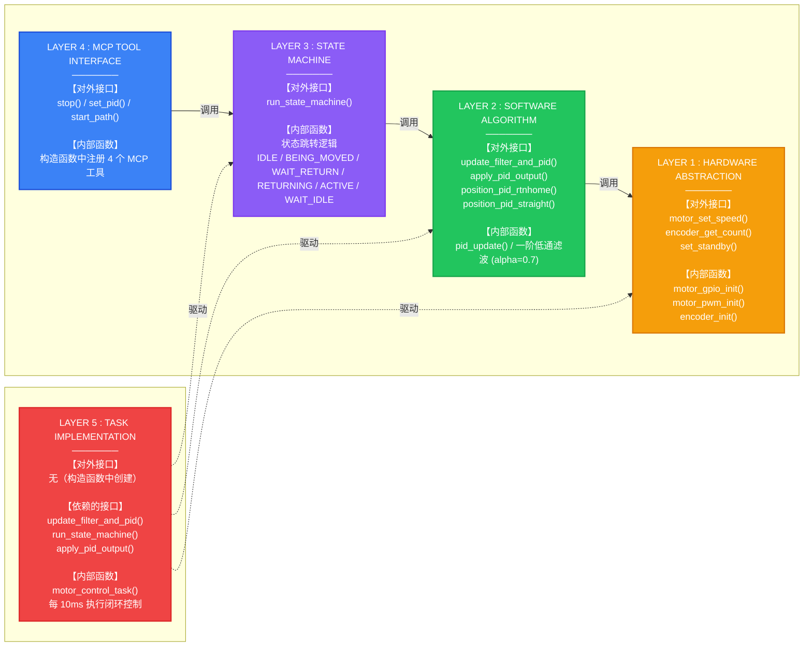
```mermaid
flowchart LR
    subgraph Left[" "]
        direction TB
        L4["LAYER 4 : MCP TOOL INTERFACE<br>───────<br>【对外接口】<br>stop() / set_pid() / start_path()<br><br>【内部函数】<br>构造函数中注册 4 个 MCP 工具"]

        L3["LAYER 3 : STATE MACHINE<br>───────<br>【对外接口】<br>run_state_machine()<br><br>【内部函数】<br>状态跳转逻辑<br>IDLE / BEING_MOVED / WAIT_RETURN / RETURNING / ACTIVE / WAIT_IDLE"]

        L2["LAYER 2 : SOFTWARE ALGORITHM<br>───────<br>【对外接口】<br>update_filter_and_pid()<br>apply_pid_output()<br>position_pid_rtnhome()<br>position_pid_straight()<br><br>【内部函数】<br>pid_update() / 一阶低通滤波 (alpha=0.7)"]

        L1["LAYER 1 : HARDWARE ABSTRACTION<br>───────<br>【对外接口】<br>motor_set_speed()<br>encoder_get_count()<br>set_standby()<br><br>【内部函数】<br>motor_gpio_init()<br>motor_pwm_init()<br>encoder_init()"]

        L4 -->|调用| L3
        L3 -->|调用| L2
        L2 -->|调用| L1
    end

    subgraph Right[" "]
        L5["LAYER 5 : TASK IMPLEMENTATION<br>───────<br>【对外接口】<br>无（构造函数中创建）<br><br>【依赖的接口】<br>update_filter_and_pid()<br>run_state_machine()<br>apply_pid_output()<br><br>【内部函数】<br>motor_control_task()<br>每 10ms 执行闭环控制"]
    end

    L5 -.->|驱动| L2
    L5 -.->|驱动| L3
    L5 -.->|驱动| L1

    style L4 fill:#3b82f6,color:#fff,stroke:#1d4ed8,stroke-width:2px
    style L3 fill:#8b5cf6,color:#fff,stroke:#7c3aed,stroke-width:2px
    style L2 fill:#22c55e,color:#fff,stroke:#16a34a,stroke-width:2px
    style L1 fill:#f59e0b,color:#fff,stroke:#d97706,stroke-width:2px
    style L5 fill:#ef4444,color:#fff,stroke:#dc2626,stroke-width:2px
```

------

#### LAYER 1：硬件抽象层（Hardware Abstraction）

**职责**：封装所有与 ESP32-S3 外设的直接交互，包括 GPIO、MCPWM（PWM 生成）、PCNT（编码器脉冲计数）。这一层没有任何业务逻辑或算法。

**关键函数**：

| 函数                              | 作用                                          |
| ------------------------------- | ------------------------------------------- |
| `motor_gpio_init()`             | 配置方向引脚（IN1/IN2）和 STBY 为输出模式                 |
| `motor_pwm_init()`              | 初始化 MCPWM 单元，PWM 频率 10kHz，两个定时器分别控制左右轮      |
| `encoder_init()`                | 初始化 PCNT 单元，配置为编码器模式（A 相脉冲，B 相方向）           |
| `motor_set_speed(motor, speed)` | 根据 speed 正负设置方向，将 duty（0-100）写入 MCPWM 比较寄存器 |
| `encoder_get_count(unit)`       | 读取指定 PCNT 单元的计数值（int16_t，范围 -32768~32767）   |
| `set_standby(enable)`           | 控制 TB6612 的 STBY 引脚（高电平使能，低电平待机）            |
|                                 |                                             |


#### LAYER 2：软件算法层（Software Algorithm）

**职责**：实现所有控制算法，包括速度 PID、位置 PID、滤波、脉冲累积。这一层不直接操作硬件，而是通过 LAYER 1 的接口获取数据并输出计算结果。

**关键变量**：

|变量名|类型|作用|
|---|---|---|
|`pid_left_`|`PIDController`|左轮速度 PID 控制器|
|`pid_right_`|`PIDController`|右轮速度 PID 控制器|
|`target_speed_left_`|`float`|左轮目标速度（-6680~6680，单位：脉冲/秒）|
|`target_speed_right_`|`float`|右轮目标速度（-6680~6680，单位：脉冲/秒）|
|`filtered_speed_left_`|`float`|左轮一阶低通滤波后的速度|
|`filtered_speed_right_`|`float`|右轮一阶低通滤波后的速度|
|`left_cumul_`|`int64_t`|左轮累积脉冲（用于位置闭环）|
|`right_cumul_`|`int64_t`|右轮累积脉冲（用于位置闭环）|
|`target_pos_left_`|`int64_t`|左轮目标位置|
|`target_pos_right_`|`int64_t`|右轮目标位置|
|`last_count_left_`|`int16_t`|左轮上一次编码器读数（用于计算增量）|
|`last_count_right_`|`int16_t`|右轮上一次编码器读数（用于计算增量）|
|`current_delta_left_`|`int32_t`|左轮最近 10ms 的脉冲增量|
|`current_delta_right_`|`int32_t`|右轮最近 10ms 的脉冲增量|
|`output_duty_left_`|`int`|左轮 PID 输出占空比（-100~100）|
|`output_duty_right_`|`int`|右轮 PID 输出占空比（-100~100）|
|`position_kp_`|`float`|位置 PID 比例系数（默认 0.005）|
|`straight_delta_max_speed_`|`float`|直线纠偏最大修正速度（默认 2000）|
|`rtn_max_speed_`|`float`|归位最大速度（默认 3340）|
|`rtn_min_speed_`|`float`|归位最小速度（默认 100）|

**关键函数**：

|函数|参数|返回值|作用|
|---|---|---|---|
|`set_target_speed(float left, float right)`|左右轮目标速度|`void`|设置目标速度，死区 <5 时强制归零|
|`pid_reset_both()`|无|`void`|重置左右轮 PID 积分项和上一次反馈值|
|`reset_all()`|无|`void`|重置所有速度、累积脉冲、PID 输出和 PID 状态|
|`position_pid_rtnhome()`|无|`void`|位置 PID 归位算法：位置误差 × 5 → 速度指令，限幅到 [rtn_min, rtn_max]|
|`position_pid_straight()`|无|`void`|位置 PID 直线纠偏：左右轮累积误差 × Kp → 速度修正量|
|`update_filter_and_pid()`|无|`void`|读取编码器 → 计算增量 → 滤波 → 速度 PID → 累积脉冲（10ms 周期调用）|
|`apply_pid_output()`|无|`void`|将 PID 输出占空比写入硬件（死区 <5 时归零）|
|`force_stop()`|无|`void`|强制设置目标速度为 0|

##### PIDController

这个我专门写了一个库，放在`CarController.h`同级目录下了。

`PIDController` 是一个独立的纯数学工具类，不依赖任何硬件，负责 PID 核心算法的计算。它在 CarController 中被用于速度环，算法实现采用的是**位置式 PID**（即每次计算直接输出完整的控制量，而非增量）。

**核心数据结构**：

|字段|类型|作用|
|---|---|---|
|`Kp` / `Ki` / `Kd`|`float`|PID 三参数|
|`out_min` / `out_max`|`float`|输出限幅（-6680 ~ 6680）|
|`integral_min` / `integral_max`|`float`|积分限幅（输出的 ±80%）|
|`prev_fb`|`float`|上一次反馈值（用于微分计算）|
|`integral`|`float`|积分累积项|
|`dt_ms`|`uint32_t`|控制周期（10ms）|

**核心算法**（`pid_update`）：


```cpp

float pid_update(PIDController *pid, float setpoint, float feedback) {
    float error = setpoint - feedback;
    float dt_sec = pid->dt_ms / 1000.0f;
    // 比例项
    float proportional = pid->Kp * error;
    // 积分项（带限幅）
    float integral = pid->integral + error * dt_sec;
    integral = clamp(integral, pid->integral_min, pid->integral_max);
    float integral_term = pid->Ki * integral;
    // 微分项（基于上一次反馈值）
    float derivative = (pid->prev_fb - feedback) / dt_sec;
    float derivative_term = pid->Kd * derivative;
    // 输出（带限幅 + 积分分离）
    float output = proportional + integral_term + derivative_term;
    output = clamp(output, pid->out_min, pid->out_max);
    
    // 积分分离：输出饱和时冻结积分项
    if (!((output >= pid->out_max && error > 0) || 
          (output <= pid->out_min && error < 0))) {
        pid->integral = integral;
    }
    pid->prev_fb = feedback;
    return output;
}
```

**算法要点**：

| 特性       | 实现方式                            | 作用                      |
| -------- | ------------------------------- | ----------------------- |
| **积分限幅** | `integral_min` / `integral_max` | 防止积分饱和（积分项最大不超过输出的 80%） |
| **输出限幅** | `out_min` / `out_max`           | 限制最终输出，防止指令超出电机物理上限     |
| **积分分离** | 输出饱和时冻结积分项                      | 防止超调，提高响应稳定性            |
| **微分先行** | `prev_fb - feedback`（基于反馈，而非误差） | 避免设定值突变时微分项剧烈跳动         |

**与 CarController 的调用关系**：

text

CarController::update_filter_and_pid()
    ├── 读取编码器 → 计算 filtered_speed
    ├── pid_update(&pid_left_, target_speed_left_, filtered_speed_left_)
    ├── pid_update(&pid_right_, target_speed_right_, filtered_speed_right_)
    └── output → 映射到占空比 → motor_set_speed()


速度环在任何运动状态下都工作。位置环分两种场景：

- `position_pid_rtnhome()`：在 `RETURNING` 状态下执行归位，固定 Kp=5.0
    
- `position_pid_straight()`：在 `ACTIVE` 状态下，当左右轮速度相同时（直行）触发纠偏

位置环的输出（目标速度）是速度环的输入。
这就是**级联**（Cascade）的含义——两个控制器串联：外环（位置）的输出作为内环（速度）的设定值，内环的输出直接控制硬件。

**为什么要这样设计？**

| 特性       | 说明                                                                |
| -------- | ----------------------------------------------------------------- |
| **抗干扰**  | 速度内环能快速响应负载变化（如路面摩擦突变、斜坡重力影响），在位置环感知到偏差之前，内环已经做出修正。内环快、外环慢，各司其职。  |

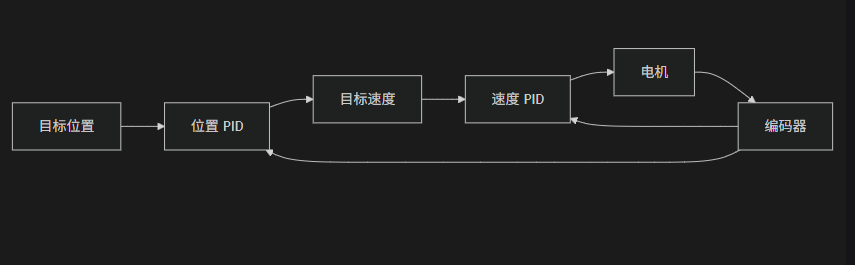


#### LAYER 3：状态机层（State Machine）

**职责**：维护小车自身的运动状态，处理“被外力推动→自动归位”和“执行用户指令→停止→待机”两条主线。这一层不直接操作硬件，通过调用 LAYER 2 和 LAYER 1 的接口实现状态跳转。

**状态枚举**：

| 状态            | 含义                  | 电机状态                                                  |
| ------------- | ------------------- | ----------------------------------------------------- |
| `IDLE`        | 完全空闲                | STBY=0（电机失能），所有变量清零                                   |
| `BEING_MOVED` | 被外力推动               | STBY=0，监测 delta 变化                                    |
| `WAIT_RETURN` | 外力停止，等待归位           | STBY=0，等待 50 ticks（500ms）无 delta 后进入 `RETURNING`      |
| `RETURNING`   | 执行位置归位              | STBY=1（电机使能），调用 `position_pid_rtnhome()` 将 cumul 拉回 0 |
| `ACTIVE`      | 执行用户指令（`move_path`） | STBY=1，按路径段执行速度指令                                     |
| `WAIT_IDLE`   | 运动停止，等待惯性消除         | STBY=0，等待 100 ticks（1s）无干扰后进入 `IDLE`                  |

**关键变量**：

|变量名|类型|作用|
|---|---|---|
|`state_`|`State`|当前状态（默认 `WAIT_IDLE`）|
|`first_enter_`|`bool`|每个状态首次进入标志（用于执行一次性初始化）|
|`wait_cnt_`|`int`|等待计数器（用于 `WAIT_RETURN` 和 `WAIT_IDLE` 的去抖延迟）|
|`path_running_`|`bool`|路径正在执行标志|
|`is_straight_`|`bool`|当前段是否为直线（用于决定是否启用 `position_pid_straight` 纠偏）|
|`force_stop_`|`bool`|外部强制停止标志（供 MCP 工具调用）|

**关键函数**：

|函数|参数|返回值|作用|
|---|---|---|---|
|`run_state_machine()`|无|`void`|状态机核心运行函数，每 10ms 调用一次，根据 `current_delta` 和计数器决定状态跳转|
|`state_to_string(State s)`|状态枚举值|`const char*`|将状态枚举转为字符串（用于调试日志）|

run_state_machine 状态转化图：

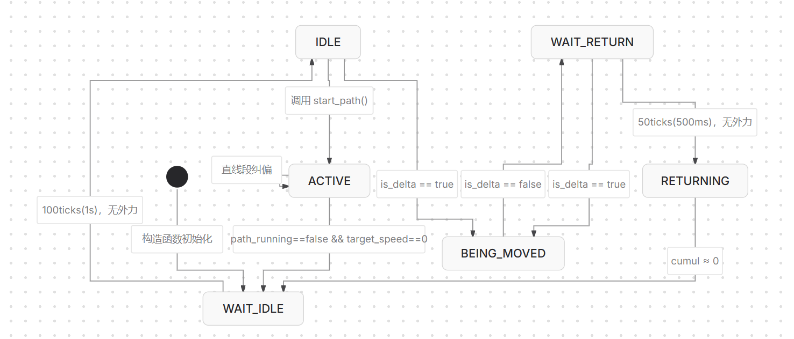


>isdelta的意思是编码器有没有变化
>cumul是编码器累计变化值

#### LAYER 4：MCP 工具接口层（MCP Tool Interface）

**职责**：对外暴露 MCP 工具，供语音助手或上位机调用。这一层负责解析 JSON 参数、调用内部接口、返回执行结果。

**注册的 MCP 工具**（在构造函数中注册）：

|工具名|功能|参数|
|---|---|---|
|`car.set_speed_pid`|修改速度 PID 参数|`left_kp`, `left_ki`, `left_kd`, `right_kp`, `right_ki`, `right_kd`（整数×100）|
|`car.set_position_pid`|修改位置 PID Kp|`position_kp`（整数×100）|
|`car.stop`|立即停止所有运动|无|
|`car.move_path`|执行多段路径|`segments`：JSON 数组，如 `[{"left":3340,"right":3340,"dur":2000}]`|

**关键函数（公有接口）** ：

|函数|参数|返回值|作用|
|---|---|---|---|
|`CarController(...)`|硬件引脚（GPIO 编号）|—|构造函数：硬件初始化 → PID 初始化 → 创建后台任务 → 注册 MCP 工具|
|`stop()`|无|`void`|立即停止所有运动，设置 `force_stop_ = true`|
|`set_pid(float, float, float, float, float, float)`|左右轮 Kp/Ki/Kd|`void`|更新速度 PID 参数并重置积分项|
|`set_position_pid(float)`|位置 PID Kp|`void`|更新位置 PID 比例系数|
|`start_path(const std::string&)`|JSON 数组字符串|`bool`|执行多段路径，成功返回 `true`，失败返回 `false`|
|`~CarController()`|无|—|析构函数：删除后台任务，释放资源|

#### LAYER 5：后台任务层（Task Implementation）

**职责**：运行一个独立的 FreeRTOS 任务 `motor_control_task`，以 10ms 周期执行控制循环。

**关键变量**：

|变量名|类型|作用|
|---|---|---|
|`motor_ctrl_task_handle_`|`TaskHandle_t`（`static`）|FreeRTOS 任务句柄，用于管理后台控制任务的生命周期|

**关键函数**：

|函数|参数|返回值|作用|
|---|---|---|---|
|`motor_control_task(void*)`|`CarController*`（通过 `arg` 传入）|`void`（`static`）|后台任务主函数：每 10ms 执行 `update_filter_and_pid()` → `run_state_machine()` → `apply_pid_output()`|

## 完整代码以及需要更改的地方：

##### pidcontroller.cpp

```cpp
#include "pid_controller.h"

#include <math.h>

  

void pid_reset(PIDController *pid){

    pid->prev_fb=0.0f;

    pid->integral=0.0f;

    pid->prev_output=0.0f;

}

  

void pid_init(PIDController *pid, float Kp,float Ki,float Kd,uint32_t dt_ms){

    pid->Kp=Kp;

    pid->Ki=Ki;

    pid->Kd=Kd;

    pid->out_min=-6680;

    pid->out_max=6680;

    pid->integral_min=pid->out_min*0.8f;

    pid->integral_max=pid->out_max*0.8f;

    pid->dt_ms=dt_ms;

    pid_reset(pid);

}

  
  
  

float pid_update(PIDController *pid, float setpoint, float feedback){

    float error=setpoint-feedback;

    float proportional=pid->Kp*error;

    float dt_sec=pid->dt_ms/1000.0f;

    float integral=pid->integral;

    integral+=error*dt_sec;

    if(integral>pid->integral_max) integral=pid->integral_max;

    else if(integral<pid->integral_min) integral=pid->integral_min;

    float integral_term=pid->Ki*integral;

    float derivative=(pid->prev_fb-feedback)/dt_sec;

    float derivative_term=derivative*pid->Kd;

    float output=proportional+integral_term+derivative_term;

    if(output>pid->out_max) output=pid->out_max;

    else if(output<pid->out_min) output=pid->out_min;

    if (output>=pid->out_max&&error>0){}

    else if (output<=pid->out_min&&error<0){}

    else {pid->integral=integral;}

    pid->prev_fb=feedback;

    pid->prev_output=output;

    return output;    

}
```

##### pid.controller.h

```cpp
#ifndef PID_CONTROLLER_H

#define PID_CONTROLLER_H

  

#include <stdint.h>

  
  
  
  

typedef struct{

    float Kp;

    float Ki;

    float Kd;

  

    float out_min;

    float out_max;

    float integral_min;

    float integral_max;

  

    float prev_fb;

    float integral;

    float prev_output;

  

    uint32_t dt_ms; // 控制周期

}PIDController;

  

void pid_init(PIDController *pid, float Kp,float Ki,float Kd,uint32_t dt_ms);

  

void pid_reset(PIDController *pid);

  

float pid_update(PIDController *pid, float setpoint, float feedback);

  

#endif
```


##### carcontroller.h

```cpp
#ifndef __CAR_CONTROLLER_H__

#define __CAR_CONTROLLER_H__

  

#include "mcp_server.h"

#include "driver/mcpwm.h"

#include "driver/gpio.h"

#include "driver/pcnt.h"

#include "esp_log.h"

#include "freertos/FreeRTOS.h"

#include "freertos/task.h"

#include "cJSON.h"

#include "pid_controller.h"

#include <math.h>

  

#define COUNTER_RANGE 32767

#define OVERFLOW_THRESHOLD 20000

  

class CarController {

  

// ================================================================

// LAYER 1 : HARDWARE ABSTRACTION (硬件抽象层)

// 职责：仅包含 GPIO、MCPWM、PCNT 的直接操作，没有任何业务逻辑。

// ================================================================

  

private:

    gpio_num_t in1_a_, in2_a_, pwm_a_;

    gpio_num_t in1_b_, in2_b_, pwm_b_;

    gpio_num_t stby_pin_;

    gpio_num_t enc_a_pin_, enc_b_pin_;    // 左轮编码器

    gpio_num_t enc_a2_pin_, enc_b2_pin_;  // 右轮编码器

  

    //函数声明

  
  
  

    void motor_gpio_init() {

        gpio_set_direction(stby_pin_, GPIO_MODE_OUTPUT);

        gpio_set_level(stby_pin_, 1);

        gpio_set_direction(in1_a_, GPIO_MODE_OUTPUT);

        gpio_set_direction(in2_a_, GPIO_MODE_OUTPUT);

        gpio_set_direction(in1_b_, GPIO_MODE_OUTPUT);

        gpio_set_direction(in2_b_, GPIO_MODE_OUTPUT);

    }

  

    void motor_pwm_init() {

        mcpwm_config_t pwm_config = {

            .frequency = 10000,

            .cmpr_a = 0,

            .cmpr_b = 0,

            .duty_mode = MCPWM_DUTY_MODE_0,

            .counter_mode = MCPWM_UP_COUNTER,

        };

        mcpwm_init(MCPWM_UNIT_0, MCPWM_TIMER_0, &pwm_config);

        mcpwm_init(MCPWM_UNIT_0, MCPWM_TIMER_1, &pwm_config);

        mcpwm_gpio_init(MCPWM_UNIT_0, MCPWM0A, pwm_a_);

        mcpwm_gpio_init(MCPWM_UNIT_0, MCPWM1A, pwm_b_);

    }

  

    void encoder_init() {

        // 左编码器 (PCNT_UNIT_0)

        pcnt_config_t pcnt_a;

        memset(&pcnt_a, 0, sizeof(pcnt_a));  // 清零

        pcnt_a.pulse_gpio_num = enc_a_pin_;

        pcnt_a.ctrl_gpio_num = enc_b_pin_;

        pcnt_a.lctrl_mode = PCNT_MODE_KEEP;

        pcnt_a.hctrl_mode = PCNT_MODE_REVERSE;

        pcnt_a.pos_mode = PCNT_COUNT_INC;

        pcnt_a.neg_mode = PCNT_COUNT_DEC;

        pcnt_a.counter_h_lim = 32767;

        pcnt_a.counter_l_lim = -32768;

        pcnt_a.unit = PCNT_UNIT_0;

        pcnt_a.channel = PCNT_CHANNEL_0;

        pcnt_unit_config(&pcnt_a);

        pcnt_counter_clear(PCNT_UNIT_0);

        pcnt_counter_resume(PCNT_UNIT_0);

  

        // 右编码器 (PCNT_UNIT_1)

        pcnt_config_t pcnt_b;

        memset(&pcnt_b, 0, sizeof(pcnt_b));

        pcnt_b.pulse_gpio_num = enc_a2_pin_;

        pcnt_b.ctrl_gpio_num = enc_b2_pin_;

        pcnt_b.lctrl_mode = PCNT_MODE_KEEP;

        pcnt_b.hctrl_mode = PCNT_MODE_REVERSE;

        pcnt_b.pos_mode = PCNT_COUNT_INC;

        pcnt_b.neg_mode = PCNT_COUNT_DEC;

        pcnt_b.counter_h_lim = 32767;

        pcnt_b.counter_l_lim = -32768;

        pcnt_b.unit = PCNT_UNIT_1;

        pcnt_b.channel = PCNT_CHANNEL_0;

        pcnt_unit_config(&pcnt_b);

        pcnt_counter_clear(PCNT_UNIT_1);

        pcnt_counter_resume(PCNT_UNIT_1);

    }

  

    void motor_set_speed(int motor, int speed) {

        if (speed > 100) speed = 100;

        if (speed < -100) speed = -100;

        int duty = abs(speed);

  

        if (motor == 0) {

            gpio_set_level(in1_a_, speed >= 0 ? 1 : 0);

            gpio_set_level(in2_a_, speed >= 0 ? 0 : 1);

            mcpwm_set_duty(MCPWM_UNIT_0, MCPWM_TIMER_0, MCPWM_OPR_A, duty);

            mcpwm_set_duty_type(MCPWM_UNIT_0, MCPWM_TIMER_0, MCPWM_OPR_A, MCPWM_DUTY_MODE_0);

        } else {

            gpio_set_level(in1_b_, speed >= 0 ? 1 : 0);

            gpio_set_level(in2_b_, speed >= 0 ? 0 : 1);

            mcpwm_set_duty(MCPWM_UNIT_0, MCPWM_TIMER_1, MCPWM_OPR_A, duty);

            mcpwm_set_duty_type(MCPWM_UNIT_0, MCPWM_TIMER_1, MCPWM_OPR_A, MCPWM_DUTY_MODE_0);

        }

    }

  

    int16_t encoder_get_count(pcnt_unit_t unit) {

        int16_t count = 0;

        pcnt_get_counter_value(unit, &count);

        return count;

    }

  

    void set_standby(bool enable){

        if(enable){

            gpio_set_level(stby_pin_,1);

        }

        else{

            gpio_set_level(stby_pin_,0);

        }  

    }

  
  
  
  
  
  

// ================================================================

// LAYER 2 : SOFTWARE ALGORITHM (软件算法层)

// ================================================================

// ---------- PID 控制器 ----------

  

private:

    PIDController pid_left_;

    PIDController pid_right_;

  

    // ---------- 速度相关（float 用于计算） ----------

    float target_speed_left_ = 0.0f;      // 目标速度（-6680~6680）

    float target_speed_right_ = 0.0f;

    float filtered_speed_left_ = 0.0f;    // 滤波后速度

    float filtered_speed_right_ = 0.0f;

  

    // ---------- 编码器累积（位置闭环） ----------

    int64_t left_cumul_ = 0;

    int64_t right_cumul_ = 0;

    int64_t target_pos_left_ = 0;

    int64_t target_pos_right_ = 0;

  

    // ---------- 上一次编码器值（用于计算增量） ----------

    int16_t last_count_left_ = 0;

    int16_t last_count_right_ = 0;

  

    int32_t current_delta_left_ = 0;

    int32_t current_delta_right_ = 0;

  

    // ---------- PID 输出（转换后给硬件） ----------

    int output_duty_left_ = 0;    // -100 ~ 100

    int output_duty_right_ = 0;

  

    // ---------- 位置 PID 参数 ----------

    float position_kp_ = 0.005f;

    float straight_delta_max_speed_ = 2000.0f;

    float rtn_max_speed_ = 3340.0f;

    float rtn_min_speed_ = 100.0f;

  

  

    // ---------- 接口函数 ----------

    void set_target_speed(float left, float right) {

        if(fabs(left)<=5.0f&&fabs(right)<=5.0f){

            target_speed_left_=0.0f;

            target_speed_right_=0.0f;

        }

        else{

            target_speed_left_ = left;

            target_speed_right_ = right;

        }

    }

  

    void pid_reset_both() {

        pid_reset(&pid_left_);

        pid_reset(&pid_right_);

    }

    void reset_all(){

        target_speed_left_=0.0f;

        target_speed_right_=0.0f;

        filtered_speed_left_=0.0f;

        filtered_speed_right_=0.0f;

        left_cumul_=0;

        right_cumul_=0;

        output_duty_left_=0;

        output_duty_right_=0;

        pid_reset_both();

    }

  

    // ---------- 位置 PID 算法（由状态机调用） ----------

    void position_pid_rtnhome() {

        // int64_t err_left = target_pos_left_ - left_cumul_;

        // int64_t err_right = target_pos_right_ - right_cumul_;

  

        // float spd_left = position_kp_ * err_left;

        // float spd_right = position_kp_ * err_right;

        int64_t err_left = target_pos_left_ - left_cumul_;

        int64_t err_right = target_pos_right_ - right_cumul_;

  

        float spd_left = 5.0 * err_left;

        float spd_right = 5.0 * err_right;

  

        // 限幅

        if (spd_left > rtn_max_speed_) spd_left = rtn_max_speed_;

        if (spd_left < -rtn_max_speed_) spd_left = -rtn_max_speed_;

        if (spd_right > rtn_max_speed_) spd_right = rtn_max_speed_;

        if (spd_right < -rtn_max_speed_) spd_right = -rtn_max_speed_;

  

        if (spd_left < rtn_min_speed_ && spd_left>0) spd_left = rtn_min_speed_;

        if (spd_left > -rtn_min_speed_ && spd_left<0) spd_left = -rtn_min_speed_;

        if (spd_right < rtn_min_speed_ && spd_right>0) spd_right = rtn_min_speed_;

        if (spd_right > -rtn_min_speed_ && spd_right<0) spd_right = -rtn_min_speed_;

  

        target_speed_left_ = spd_left;

        target_speed_right_ = spd_right;

    }

  

    void position_pid_straight() {

        int64_t err = right_cumul_ - left_cumul_;

        float delta_spd = position_kp_ * err;

  

        if (delta_spd > straight_delta_max_speed_) delta_spd = straight_delta_max_speed_;

        if (delta_spd < -straight_delta_max_speed_) delta_spd = -straight_delta_max_speed_;

  

        target_speed_left_ += delta_spd;

        target_speed_right_ -= delta_spd;

    }

  

    // ---------- 滤波 + PID 执行（由 Task 调用） ----------

    void update_filter_and_pid() {

        const float dt = 0.010f;  // 固定 10ms

  

        // 1. 硬件读取（原本在 Task 里做的，现在搬进来）

        int16_t countL = encoder_get_count(PCNT_UNIT_0);

        int16_t countR = encoder_get_count(PCNT_UNIT_1);

  

        int32_t deltaL = countL - last_count_left_;

        int32_t deltaR = countR - last_count_right_;

        // 2. 溢出处理（原 Task 中的逻辑）

        if (deltaL > OVERFLOW_THRESHOLD) deltaL -= COUNTER_RANGE;

        else if (deltaL < -OVERFLOW_THRESHOLD) deltaL += COUNTER_RANGE;

        if (deltaR > OVERFLOW_THRESHOLD) deltaR -= COUNTER_RANGE;

        else if (deltaR < -OVERFLOW_THRESHOLD) deltaR += COUNTER_RANGE;

  

        // 3. 更新上一次读数（供下次使用）

        last_count_left_ = countL;

        last_count_right_ = countR;

  

        // ESP_LOGI("ENC", "L=%d R=%d", countL, countR);

  

        // 4. 计算原始速度、滤波（原逻辑不变）

        float raw_speed_left = deltaL / dt;

        float raw_speed_right = deltaR / dt;

  

        const float alpha = 0.7f;

        filtered_speed_left_ = alpha * raw_speed_left + (1.0f - alpha) * filtered_speed_left_;

        filtered_speed_right_ = alpha * raw_speed_right + (1.0f - alpha) * filtered_speed_right_;

  

        // 5. PID 计算（原逻辑不变）

        float output_left = pid_update(&pid_left_, target_speed_left_, filtered_speed_left_);

        float output_right = pid_update(&pid_right_, target_speed_right_, filtered_speed_right_);

  

        // 6. 转换为占空比输出（原逻辑不变）

        output_duty_left_ = (int)(output_left / 66.8f);

        output_duty_right_ = (int)(output_right / 66.8f);

  

        if (output_duty_left_ > 100) output_duty_left_ = 100;

        if (output_duty_left_ < -100) output_duty_left_ = -100;

        if (output_duty_right_ > 100) output_duty_right_ = 100;

        if (output_duty_right_ < -100) output_duty_right_ = -100;

  

        // 7. 累积脉冲（供位置 PID 使用）

        left_cumul_ += deltaL;

        right_cumul_ += deltaR;

        current_delta_left_ = deltaL;

        current_delta_right_ = deltaR;

    }

  

    // ---------- 输出到硬件（由 Task 调用） ----------

    void apply_pid_output() {

        // 注意：motor_set_speed 的第一个参数是 motor 编号

        // 0 = 左轮，1 = 右轮（根据你的硬件定义）

        if(fabs(output_duty_left_)<5) output_duty_left_=0;

        if(fabs(output_duty_right_)<5) output_duty_right_=0;

        motor_set_speed(1, output_duty_left_);   // 左轮

        motor_set_speed(0, output_duty_right_);  // 右轮

    }

    void force_stop(){

        set_target_speed(0,0);

    }

  
  
  

// ================================================================

// LAYER 3 : STATE MACHINE (状态机层)

// 职责：维护状态枚举、处理去抖延迟、决定状态跳转。

// 注意：这里不直接操作硬件，通过调用 LAYER 2 和 LAYER 1 的接口实现。

// ================================================================

  

public:

    // 暴露给外部的状态枚举（便于调试）

    enum class State {

        IDLE,           // 完全空闲，电机失能

        BEING_MOVED,    // 被外力推动中，电机失能

        WAIT_RETURN,    // 外力停止，等待 15 ticks 后归位

        RETURNING,      // 【独立顶级状态】执行位置归位（回原点）

        ACTIVE,         // 【独立顶级状态】执行用户主动指令（move_path）

        WAIT_IDLE       // 运动停止，等待 15 ticks 消除惯性

    };

  

private:

    State state_ = State::WAIT_IDLE;

    bool first_enter_ = true;   // 每个状态首次进入标志

    int wait_cnt_ = 0;          // 用于 WAIT_xxx 状态的计数器

    bool path_running_ = false;

    bool is_straight_=false;

    bool force_stop_ = false;   // 外部强制停止标志（供 MCP 工具调用）

  
  
  

        // 状态机核心运行函数（定义在类内部）

  

    void run_state_machine() {

        bool is_delta = (fabs(current_delta_left_) != 0 || fabs(current_delta_right_) != 0);

  

        if(force_stop_){

            force_stop();

            wait_cnt_=0;

            is_straight_=false;

            path_running_=false;

            first_enter_=true;

            state_=State::WAIT_IDLE;

            force_stop_=false;

        }

  

        switch (state_) {

            case State::IDLE:

                if (first_enter_) {

                    set_standby(false);

                    // pid_reset_both();

                    reset_all();

                    first_enter_ = false;

                }

                if (is_delta) {

                    state_ = State::BEING_MOVED;

                    first_enter_ = true;

                }

                break;

  

            case State::BEING_MOVED:

                if (first_enter_) {

                    set_standby(false);

                    first_enter_ = false;

                }

                if (!is_delta) {

                    state_ = State::WAIT_RETURN;

                    wait_cnt_ = 0;

                    first_enter_ = true;

                }

                break;

  

            case State::WAIT_RETURN:

                if (first_enter_) {

                    set_standby(false);

                    first_enter_ = false;

                }

                if (is_delta) {

                    state_ = State::BEING_MOVED;

                    first_enter_ = true;

                    wait_cnt_=0;

                } else if (++wait_cnt_ >= 50) {

                    state_ = State::RETURNING;

                    target_pos_left_ = 0;

                    target_pos_right_ = 0;

                    first_enter_ = true;

                    wait_cnt_ = 0;

                }

                break;

  

            case State::RETURNING:

                if (first_enter_) {

                    set_standby(true);

                    pid_reset_both();

                    first_enter_ = false;

                }

                position_pid_rtnhome();

  

                if ((abs(left_cumul_) <= 15 && abs(right_cumul_) <= 15)) {

                    state_ = State::WAIT_IDLE;

                    wait_cnt_ = 0;

                    first_enter_ = true;

                    set_standby(false);

                    force_stop_ = false;

                }

                break;

  

            case State::ACTIVE:

                if (first_enter_) {

                    set_standby(true);

                    pid_reset_both();

                    first_enter_ = false;

                }

                // 若需要直线纠偏，可在此处调用 position_pid_straight()

                if(!path_running_){

                    if ((fabs(target_speed_left_) < 0.5f && fabs(target_speed_right_) < 0.5f)) {

                        state_ = State::WAIT_IDLE;

                        first_enter_ = true;

                        set_standby(false);

                    }

                }

                else{

                    if(is_straight_){

                        position_pid_straight();

                    }

                }

                break;

  

            case State::WAIT_IDLE:

                if (first_enter_) {

                    first_enter_ = false;

                    wait_cnt_=0;

                }

                // if (!force_stop_&&is_delta) {

                //     state_ = State::BEING_MOVED;

                //     first_enter_ = true;

                // } else

                if (++wait_cnt_ >= 100) {

                    state_ = State::IDLE;

                    reset_all();

                    first_enter_ = true;

                }

                break;

        }

    }

  

        // 状态名转字符串（调试打印用）

    const char* state_to_string(State s) {

        switch (s) {

            case State::IDLE:         return "IDLE";

            case State::BEING_MOVED:  return "BEING_MOVED";

            case State::WAIT_RETURN:  return "WAIT_RETURN";

            case State::RETURNING:    return "RETURNING";

            case State::ACTIVE:       return "ACTIVE";

            case State::WAIT_IDLE:    return "WAIT_IDLE";

            default:                  return "UNKNOWN";

        }

    }

  
  
  
  
  
  
  
  
  

// ================================================================

// LAYER 5 : TASK IMPLEMENTATION (放在类定义外部或内部)

// ================================================================

  
  

private:

    static TaskHandle_t motor_ctrl_task_handle_;  

  

    // 任务函数实现（可以直接在类内部定义，但 static 成员函数可以放在类外）

    static void motor_control_task(void* arg) {

        CarController* self = static_cast<CarController*>(arg);

        TickType_t xLastWakeTime = xTaskGetTickCount();

        const float dt = 0.010f;  // 10ms

  

        // 初始化上一次编码器值

        self->last_count_left_ = self->encoder_get_count(PCNT_UNIT_0);

        self->last_count_right_ = self->encoder_get_count(PCNT_UNIT_1);

  

        static int print_cnt = 0;

  

        while (1) {

            // 精确延时 10ms

            vTaskDelayUntil(&xLastWakeTime, pdMS_TO_TICKS(10));

  
  

            // ========== 1. 执行软件算法（LAYER 2） ==========

            // 滤波 + 速度PID，计算结果存入 output_duty_left_/right_

            self->update_filter_and_pid();

  

            // ========== 2. 运行状态机（LAYER 3） ==========

            // 状态机内部会根据 delta 和当前状态决定跳转，并可能调用 LAYER 2 的位置PID

            self->run_state_machine();

  
  

            // ========== 3. 输出到硬件（LAYER 1） ==========

            self->apply_pid_output();   // 调用 motor_set_speed

  

            // ========== 4. 调试打印（可选） ==========

            if (++print_cnt % 25 == 0) {

                ESP_LOGI("CarCtrl",

                        "State=%s, tL=%.1f tR=%.1f, dutyL=%d dutyR=%d, cumL=%d cumR=%d",

                        self->state_to_string(self->state_),

                        self->target_speed_left_, self->target_speed_right_,

                        self->output_duty_left_, self->output_duty_right_,

                        (int)self->left_cumul_, (int)self->right_cumul_);

            }

        }

    }

  

    // ================================================================

    // LAYER 4 : MCP TOOL INTERFACE (应用接口层)

    // 职责：对外暴露 MCP 工具，解析 JSON，调用内部接口。

    // 这些函数由构造函数中的 lambda 回调调用。

    // ================================================================

public:

  

    // ---------- 构造函数（内部注册所有 MCP 工具） ----------

    CarController(

        gpio_num_t in1_a, gpio_num_t in2_a, gpio_num_t pwm_a,

        gpio_num_t in1_b, gpio_num_t in2_b, gpio_num_t pwm_b,

        gpio_num_t stby_pin,

        gpio_num_t enc_a, gpio_num_t enc_b,

        gpio_num_t enc_a2, gpio_num_t enc_b2)

        : in1_a_(in1_a), in2_a_(in2_a), pwm_a_(pwm_a),

          in1_b_(in1_b), in2_b_(in2_b), pwm_b_(pwm_b),

          stby_pin_(stby_pin),

          enc_a_pin_(enc_a), enc_b_pin_(enc_b),

          enc_a2_pin_(enc_a2), enc_b2_pin_(enc_b2)

    {

        // ===== 1. 硬件初始化（LAYER 1） =====

        motor_gpio_init();

        motor_pwm_init();

        encoder_init();

  

        // ===== 2. PID 初始化（LAYER 2） =====

        pid_init(&pid_left_,  0.5f, 0.0f, 0.0f, 10);

        pid_init(&pid_right_, 0.5f, 0.0f, 0.0f, 10);

        pid_left_.out_min = -6680;

        pid_left_.out_max = 6680;

        pid_right_.out_min = -6680;

        pid_right_.out_max = 6680;

  

        // 默认停止

        set_target_speed(0, 0);

  

        // ===== 3. 创建后台任务（LAYER 5） =====

        xTaskCreate(motor_control_task, "MotorPID", 4096, this, 5, &motor_ctrl_task_handle_);

  

        // ===== 4. 注册 MCP 工具 =====

        auto& server = McpServer::GetInstance();

  

        // ----- Tool 1: 设置速度 PID 参数 -----

        server.AddTool("car.set_speed_pid",

            "Set PID parameters for speed. All values are integers *100 (e.g., 800 = 8.00).",

            PropertyList({

                Property("left_kp", kPropertyTypeInteger, 800, 0, 10000),

                Property("left_ki", kPropertyTypeInteger, 100, 0, 10000),

                Property("left_kd", kPropertyTypeInteger, 0, 0, 10000),

                Property("right_kp", kPropertyTypeInteger, 800, 0, 10000),

                Property("right_ki", kPropertyTypeInteger, 100, 0, 10000),

                Property("right_kd", kPropertyTypeInteger, 0, 0, 10000),

            }),

            [this](const PropertyList& props) -> ReturnValue {

                float lkp = props["left_kp"].value<int>() / 100.0f;

                float lki = props["left_ki"].value<int>() / 100.0f;

                float lkd = props["left_kd"].value<int>() / 100.0f;

                float rkp = props["right_kp"].value<int>() / 100.0f;

                float rki = props["right_ki"].value<int>() / 100.0f;

                float rkd = props["right_kd"].value<int>() / 100.0f;

                set_pid(lkp, lki, lkd, rkp, rki, rkd);

                return true;

            });

  

        // ----- Tool 2: 设置位置 PID 参数 -----

        server.AddTool("car.set_position_pid",

            "Set position PID Kp (integer *100, e.g., 50 = 0.50).",

            PropertyList({

                Property("position_kp", kPropertyTypeInteger, 50, 0, 10000),

            }),

            [this](const PropertyList& props) -> ReturnValue {

                float position_kp = props["position_kp"].value<int>() / 100.0f;

                set_position_pid(position_kp);

                return true;

            });

  

        // ----- Tool 3: 立即停止 -----

        server.AddTool("car.stop",

            "Stop the car immediately. This will cancel any ongoing movement.",

            PropertyList(),

            [this](const PropertyList&) -> ReturnValue {

                stop();

                return true;

            });

  

        // ----- Tool 4: 多段路径运动 -----

        server.AddTool("car.move_path",

            "Execute one or more continuous movement segments. "

            "The 'segments' parameter must be a JSON array string: "

            "[{\"left\":3340,\"right\":3340,\"dur\":2000}, ...]. "

            "Speed range: -6680 to 6680. Duration in milliseconds."

            "If speed not declared, use 3340.",

            PropertyList({

                Property("segments", kPropertyTypeString)

            }),

            [this](const PropertyList& props) -> ReturnValue {

                std::string json = props["segments"].value<std::string>();

                return start_path(json);

            });

  

        ESP_LOGI("CarController", "MCP tools registered successfully.");

    }

  

    // ---------- 公共接口函数 ----------

  

    // 立即停止

    void stop() {

        force_stop_ = true;

        ESP_LOGI("CarController", "Stop command received");

    }

  

    // 设置速度 PID 参数

    void set_pid(float kp_l, float ki_l, float kd_l,

                 float kp_r, float ki_r, float kd_r) {

        pid_left_.Kp = kp_l;

        pid_left_.Ki = ki_l;

        pid_left_.Kd = kd_l;

        pid_right_.Kp = kp_r;

        pid_right_.Ki = ki_r;

        pid_right_.Kd = kd_r;

        pid_reset_both();

        ESP_LOGI("CarController", "PID updated: L(%.2f,%.2f,%.2f) R(%.2f,%.2f,%.2f)",

                 kp_l, ki_l, kd_l, kp_r, ki_r, kd_r);

    }

  

    // 设置位置 PID 的 Kp

    void set_position_pid(float kp) {

        position_kp_ = kp;

        ESP_LOGI("CarController", "Position Kp updated: %.2f", kp);

    }

  

    // 执行多段路径（JSON 数组）

    bool start_path(const std::string& segments_json) {

        path_running_ = true;

        cJSON* root = cJSON_Parse(segments_json.c_str());

        if (root == nullptr || !cJSON_IsArray(root)) {

            ESP_LOGE("CarController", "Invalid segments JSON: %s", segments_json.c_str());

            path_running_=false;

            return false;

        }

        if (state_ == State::ACTIVE || state_ == State::RETURNING) {

            force_stop_ = true;

            int timeout = 0;

            while ((state_ != State::IDLE) && timeout < 50) {  // 最大等待 500ms

                vTaskDelay(pdMS_TO_TICKS(10));  // ✅ 让出 CPU

                timeout++;

            }

            force_stop_ = false;

        }

        state_ = State::ACTIVE;

        first_enter_ = true;

  

        int array_size = cJSON_GetArraySize(root);

        ESP_LOGI("CarController", "Starting path with %d segments", array_size);

  

        for (int i = 0; i < array_size; i++) {

            is_straight_=false;

            cJSON* seg = cJSON_GetArrayItem(root, i);

            if (!cJSON_IsObject(seg)) {

                ESP_LOGW("CarController", "Segment %d is not an object, skipping", i);

                continue;

            }

  

            cJSON* left = cJSON_GetObjectItem(seg, "left");

            cJSON* right = cJSON_GetObjectItem(seg, "right");

            cJSON* dur = cJSON_GetObjectItem(seg, "dur");

  

            if (!cJSON_IsNumber(left) || !cJSON_IsNumber(right) || !cJSON_IsNumber(dur)) {

                ESP_LOGW("CarController", "Segment %d missing valid left/right/dur, skipping", i);

                continue;

            }

  

            int l = left->valueint;

            int r = right->valueint;

            int d = dur->valueint;

  

            if(l==r) is_straight_=true;

  

            set_target_speed((float)l, (float)r);

            ESP_LOGI("CarController", "Segment %d: L=%d, R=%d, dur=%d ms", i, l, r, d);

  

            // 分段等待，便于响应 force_stop_

            const int steps = 5;

            int step_delay = d / steps;

            for (int j = 0; j < steps; j++) {

                if (force_stop_) {

                    path_running_=false;

                    set_target_speed(0, 0);

                    ESP_LOGI("CarController", "Path interrupted by stop");

                    cJSON_Delete(root);

                    return true;

                }

                vTaskDelay(pdMS_TO_TICKS(step_delay));

            }

        }

        is_straight_=false;

        path_running_ = false;

        set_target_speed(0, 0);

        cJSON_Delete(root);

        ESP_LOGI("CarController", "Path completed successfully");

        return true;

    }

  

    // 单段定时运动（兼容旧接口，内部复用 start_path）

    // void move_timed(int left_speed, int right_speed, int duration_ms) {

    //     char json_buf[128];

    //     snprintf(json_buf, sizeof(json_buf),

    //              "[{\"left\":%d,\"right\":%d,\"dur\":%d}]",

    //              left_speed, right_speed, duration_ms);

    //     start_path(std::string(json_buf));

    // }

  

    // ---------- 析构函数 ----------

    ~CarController() {

        if (motor_ctrl_task_handle_ != nullptr) {

            vTaskDelete(motor_ctrl_task_handle_);

        }

    }

};

  
  
  
  
  

TaskHandle_t CarController::motor_ctrl_task_handle_ = nullptr;

  
  
  

#endif // __CAR_CONTROLLER_H__
```


##### compact_wiifi_board.cc里需要在initializeTools里增加：

```cpp
    void InitializeTools() {

        // static LampController lamp(LAMP_GPIO);

        static CarController car(

            GPIO_NUM_17, // IN1_A

            GPIO_NUM_18, // IN2_A

            GPIO_NUM_8, // PWM_A

            GPIO_NUM_9, // IN1_B

            GPIO_NUM_10, // IN2_B

            GPIO_NUM_13, // PWM_B

            GPIO_NUM_14,  // STBY

            GPIO_NUM_2,  // ENC A1

            GPIO_NUM_37,  // ENC A2

            GPIO_NUM_21, // ENC B1

            GPIO_NUM_38  // ENC B2

        );

    }
```


##### cMakeLists(main目录下的而不是根目录下的） 需要增加：

```cpp
set(SOURCES "audio/audio_codec.cc"

            "audio/audio_service.cc"

            "audio/demuxer/ogg_demuxer.cc"

            "audio/codecs/no_audio_codec.cc"

            "audio/codecs/box_audio_codec.cc"

            "audio/codecs/es8311_audio_codec.cc"

            "audio/codecs/es8374_audio_codec.cc"

            "audio/codecs/es8388_audio_codec.cc"

            "audio/codecs/es8389_audio_codec.cc"

            "audio/codecs/dummy_audio_codec.cc"

            "audio/processors/audio_debugger.cc"

            "led/single_led.cc"

            "led/circular_strip.cc"

            "led/gpio_led.cc"

            "display/display.cc"

            "display/lcd_display.cc"

            "display/oled_display.cc"

            "display/lvgl_display/lvgl_display.cc"

            "display/emote_display.cc"

            "display/lvgl_display/emoji_collection.cc"

            "display/lvgl_display/lvgl_theme.cc"

            "display/lvgl_display/lvgl_font.cc"

            "display/lvgl_display/lvgl_image.cc"

            "display/lvgl_display/gif/lvgl_gif.cc"

            "display/lvgl_display/gif/gifdec.c"

            "display/lvgl_display/png/image_to_jpeg.cpp"

            "display/lvgl_display/png/jpeg_to_image.c"

            "protocols/protocol.cc"

            "protocols/mqtt_protocol.cc"

            "protocols/websocket_protocol.cc"

            "mcp_server.cc"

            "system_info.cc"

            "application.cc"

            "ota.cc"

            "settings.cc"

            "device_state_machine.cc"

            "assets.cc"

            "main.cc"

            "boards/bread-compact-wifi/pid_controller.cpp" //<---加这一行

            )
```


>**为什么 `pid_controller.cpp` 放在 `boards/bread-compact-wifi/` 目录下，而不是 `main/` 或者 `components/`？**
>
>因为 `pid_controller` 是 CarController 的专属依赖，目前只被这个板子使用。如果将来其他板子也用 PID，可以把它抽到 `components/` 目录下。

##### 在idf.py menuconfig里关闭PSRAM。

## 测试+调参

这个部分非常痛苦，烧了一个芯片和一根导线，重焊了4次SPEAKER，战损一个SPEAKER，重焊了一次电池盒。

讲一下调参吧。
调参套的就是速度pid的那三个参数和位置pid的那一个参数。
因为每次烧录太麻烦了，所以我干脆也注册成一个可以语音调用的MCP工具了，缺点是reset后就丢了，要及时记录。

这里调参的建议是：
不要在小智的框架下调，最好自己写一个motor_test.cc测试，串口输出编码器的值。

最好能够用串口设置或者语音改变pid参数，再搭配上vofa来调参。

调参的顺序是先内环后外环。

对于速度pid，先调kp，调到刚开始震荡的时候取70%。
只有kp的话会产生稳态误差，所以需要引入ki。
kd可选，太大会产生震荡（因为是求导嘛哪个omega就出来了，会有高频震荡）。

对于位置pid，return的那个环我调的是5.0，比较丝滑；straight的那个环是0.005，太大的话会摇摆到怀疑人生。但是直行还是不是非常直，因为目前判断直不直的标准是编码器读数，而轮子不一定完全平行且轮子的直径不一定一样。如果想要完全直行可能还是得加入IMU。


# 成果展示

**小车功能列表**

- **语音控制运动**：通过语音指令控制小车前进、后退、转弯，S形......支持多段连续路径（如“前进2秒→左转1秒→停止”）
    
- **自动归位**：外力推动小车离开原位后，外力松开时小车自动回到原始位置（类似回正功能）
    
- **直线行驶纠偏**：直线运动时自动修正左右轮偏差，防止跑偏
    
- **紧急停止**：语音指令“停车”或“stop”可立即中断所有运动
    
- **PID参数在线调节**：通过语音指令动态调整运动手感
    
- **推动检测**：外力推动时电机自动释放（失能），避免“硬推电机”损坏齿轮

配一张图：

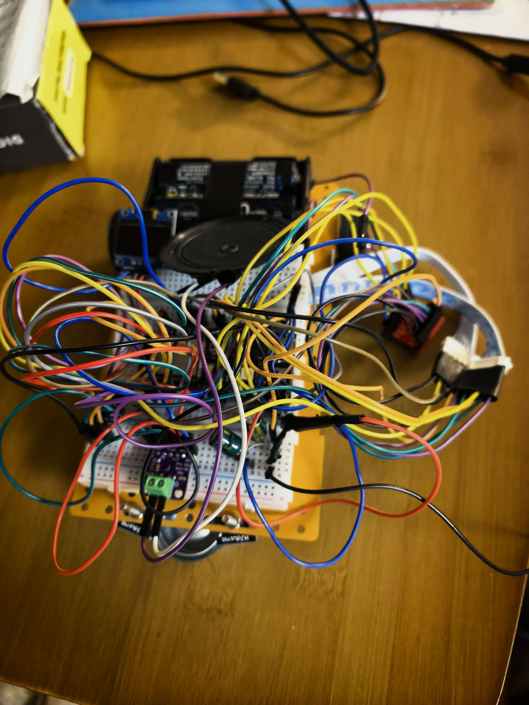

------


# 附录

接下来讲一下如何在电脑端跑一个服务器，捕获日志。

1. 从git上拉取server的代码。

```bash
git clone https://github.com/xinnan-tech/xiaozhi-esp32-server.git
```

2. 配置api key。
在`xiaozhi-esp32-server-main\main\xiaozhi-server\data`里创建`.config.yaml`，往里面放入如下内容。

```cpp
# data/.config.yaml
# 此文件会覆盖 config.yaml 中的对应配置

# 选择 LLM 模块
selected_module:
  LLM: ChatGLMLLM
  Intent: function_call   # 启用 function_call 以支持 MCP 工具（小车控制）

# 配置 ChatGLM (智谱AI) - 使用免费模型 glm-4-flash
LLM:
  ChatGLMLLM:
    type: openai
    model_name: glm-4-flash
    url: https://open.bigmodel.cn/api/paas/v4/
    api_key:   # ← 替换成你申请的真实 API Key
    temperature: 0.7
    max_tokens: 500

# Intent 配置 - 启用 function_call，让大模型能调用你的 MCP 工具
Intent:
  function_call:
    type: function_call
    # 这里可以加上你需要的本地工具插件
    functions:
      - handle_exit_intent   # 退出意图（系统自带）
      - play_music           # 音乐播放（系统自带，可选）
      # 你的小车控制工具不需要在这里配置，因为它是 ESP32 端的 MCP 工具，
      # 会在连接时自动上报给服务器
```

我个人用的是`glm-4-flash`，免费的，可以去网站申请apikey。

3. 配置环境。
我用anaconda prompt配置了一个虚拟环境。
```bash
conda create -n xiaozhi python=3.12
conda activate xiaozhi
cd 你的文件夹路径\xiaozhi-esp32-server\main\xiaozhi-server
pip install -r requirements.txt
# 使用清华镜像源加速安装
pip install -r requirements.txt -i https://pypi.tuna.tsinghua.edu.cn/simple
```

4. 开启server。
在命令行中执行：
```bash
你的文件夹路径\xiaozhi-esp32-server-main\main\xiaozhi-server>python app.py
```

5. xiaozhi-main的代码里需要修改ota-url。
详情可以看[](#otadata)。

# 展望

1. 这个杜邦线太乱了，后续打算集成成一块板子。（二编：已经完成了，勉强能用）
2. 现在Carcontroller.h 虽然可以用，但是最好可以分开变成cpp和h，或者进行更细的分层。
3. PID调参太不专业了，最好能用串口绘图工具实时看到。（二编：用上vofa+了）
4. 在Carcontroller.h里面应该添加mutex数据锁，进行保护。
5. Carcontroller.h里面的start_path用了vTaskDelay，可能会卡Application主线程，最好能放到motor_control_task里面去。
6. 应该深入研究一下单电源供电时reset的问题，探究一下用大电容是不是可以解决。（二编：电路板上加上了）
7. 希望能够加一些寻迹的功能，貌似引脚不是很充裕。


# 后续

我按照图上的接线画了一块板子。

原理图如下：

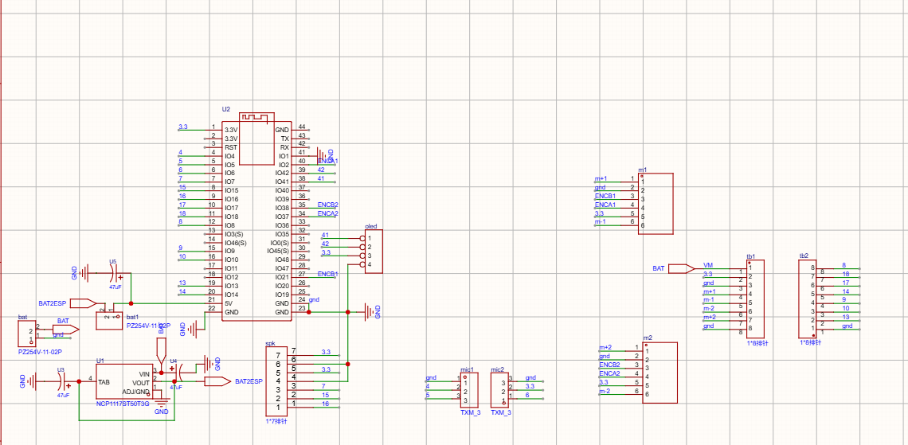

PCB图如下：

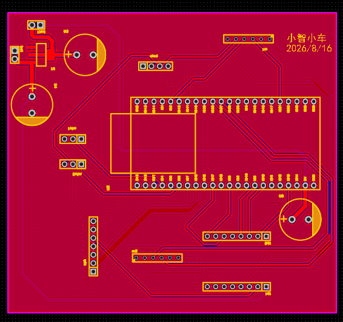

接线的时候发现出大问题，在原理图上旋转180后pcb上面的封装没有跟着转，所以我成对的那些排母都废了（愚蠢至极😐）。最后把mic重焊+飞线，tb6612重焊+飞线+改代码引脚定义暴力解决了。

然后再提醒一下esp32s3的gpio1要接地，不然reset会出问题。

最后做出来是这样：

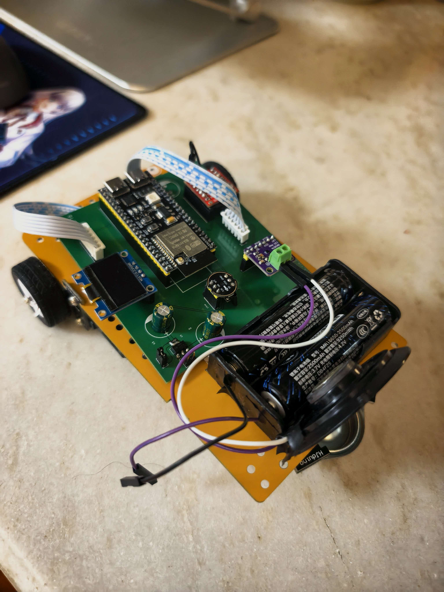

# 谢谢阅读！
